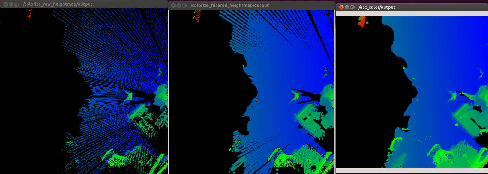

# HeightmapTimeAccumulation



Accumulate heightmap in time series and construct a new heightmap.

## Subscription Topic
* `~input` (`sensor_msgs/Image`)

  Input new heightmap(t=k).

* `~input/prev_pointcloud` (`sensor_msgs/PointCloud2`)

  Accumulated heightmap represented in pointcloud from 0 to k-1 step.

* `~input/config` (`jsk_recognition_msgs/HeightmapConfig`)

  Config topic.

## Publishing Topic
* `~output` (`sensor_msgs/Image`)

  Accumulated heightmap.

* `~output/config` (`jsk_recognition_msgs/HeightmapConfig`)

  Config topic.

## Advertising Service
* `~reset` (`std_srvs/Empty`)

  Reset heightmap cache.

## Parameters
* `~fixed_frame_id` (String, required)

  Fixed frame ID used for transforming pointcloud from previous coordinate to
  current coordinate.

* `~center_frame_id` (String, required)

  Center frame ID used for transforming pointcloud from previous coordinate to
  current coordinate.

* `~tf_queue_size` (Int, default: `10`)

  Queue size for `tf::MessageFilter`.

* `~use_offset` (Bool, default: `false`)

  use averaging height offset to fit input and prev_pointcloud

  This parameter can be changed by `dynamic_reconfigure`.

* `~use_bilateral` (Bool, default: `false`)

  use bilateral filtering after accumulation

  This parameter can be changed by `dynamic_reconfigure`.

* `~bilateral_filter_size` (Integer, default: `5`)

  Kernel size of bilateral filtering.

  This parameter can be changed by `dynamic_reconfigure`.

* `~bilateral_sigma_color` (Double, default: `0.04`)

  filter sigma of color space.

  This parameter can be changed by `dynamic_reconfigure`.

* `~bilateral_sigma_space` (Double, default: `5`)

  filter sigma of coordinate space.

  This parameter can be changed by `dynamic_reconfigure`.

## Sample

```bash
roslaunch jsk_pcl_ros sample_heightmap_time_accumulation.launch
```
