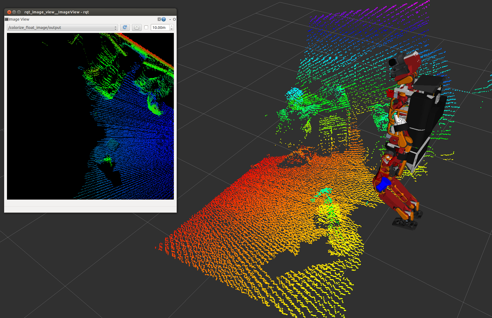

# HeightmapToPointCloud


Convert a heightmap to pointcloud.

## Subscribing Topic
* `~input` (`sensor_msgs/Image`)

  Input heightmap.

  Encoding should be `32FC2`.

* `~input/config` (`jsk_recognition_msgs/HeightmapConfig`)

  Config topic.

## Publishing Topic
* `~output` (`sensor_msgs/PointCloud2`)

  Output pointcloud.

* `~output/config` (`jsk_recognition_msgs/HeightmapConfig`)

  Config topic.

## Parameters
* `~keep_organized` (Bool, default: `False`)

  Whether to keep pointcloud organized or not.

## Sample

```bash
roslaunch jsk_pcl_ros sample_heightmap_to_pointcloud.launch
```
