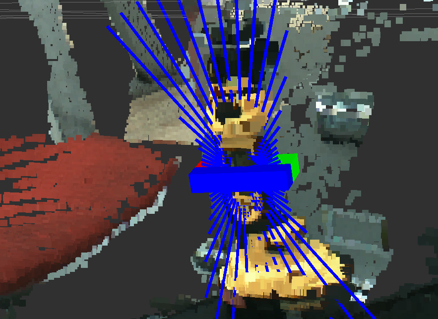
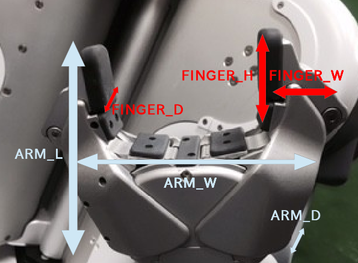

# HintedHandleEstimator

Detect a handle grasp pose from pointcloud and point as hint.

## Subscribing Topic
* `~cloud` (`sensor_msgs/PointCloud2`)

  Input pointcloud

* `~point` (`geometry_msgs/PointStamped`)

  3D Point (You can get from rviz "Publish Point" or image_view2)

## Publishing Topic
* `handle_pose` (`geometry_msgs::PoseStamped`)

  estimated handle pose

* `handle_length` (`std_msgs::Float64`)

  estimated handle length

* `debug_marker` (`visualization_msgs::Marker`)

  the result of calculating handle direction

* `debug_marker_array` (`visualization_msg::MarkerArray`)

  estimated handle visualization

## Parameters

* `~finger_l` (Float, default: `0.03`)
* `~finger_w` (Float, default: `0.01`)
* `~finger_d` (Float, default: `0.02`)
* `~arm_l` (Float, default: `0.05`)
* `~arm_w` (Float, default: `0.1`)
* `~arm_d` (Float, default: `0.01`)

