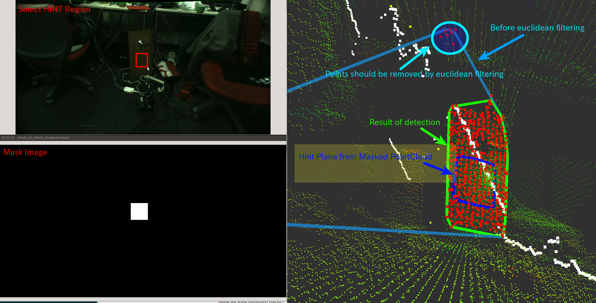

# HintedPlaneDetector
## What Is This

Estimate plane parameter from small 'hint' pointcloud and grow it to detect larger plane.

Algorithm is:

1. Detect hint plane from small hint pointcloud using RANSAC
2. Filter `~input` pointcloud based on distance and normal direction with hint plane.
3. Detect plane from the pointcloud using RANSAC
4. Segment clusters out of the inliers of the detected plane based on euclidean metrics
5. Apply density filter
6. Extract points from the nearest segmented clusters to the centroid of hint plane
7. Compute convex hull of the extracted points

## Subscribing Topic

* `~input` (`sensor_msgs/PointCloud2`)

  Input pointcloud. It is required to have normal and xyz fields.

* `~input/hint/cloud` (`sensor_msgs/PointCloud2`)

  Hint pointcloud to estimate plane parameter and only xyz fieleds are required.

## Publishing Topic

* `~output/polygon` (`geometry_msgs/PolygonStamped`)
* `~output/polygon_array` (`jsk_recognition_msgs/PolygonArray`)
* `~output/inliers` (`pcl_msgs/PointIndices`)
* `~output/coefficients` (`pcl_msgs/ModelCoefficients`)

  Result of detection.

* `~output/hint/polygon` (`geometry_msgs/PolygonStamped`)
* `~output/hint/polygon_array` (`jsk_recognition_msgs/PolygonArray`)
* `~output/hint/inliers` (`pcl_msgs/PointIndices`)
* `~output/hint/coefficients` (`pcl_msgs/ModelCoefficients`)

  Result of detection of hint pointcloud.

* `~output/hint_filtered_indices` (`pcl_msgs/PointIndices`)
* `~output/plane_filtered_indices` (`pcl_msgs/PointIndices`)
* `~output/density_filtered_indices` (`pcl_msgs/PointIndices`)
* `~output/euclidean_filtered_indices` (`pcl_msgs/PointIndices`)

  Candidate point indices filtered by each filtering phase.

## Parameters

### Parameters for detecting hint plane
* `~hint_outlier_threashold` (Double, default: `0.1`)

  Outlier threshold to detect hint plane using RANSAC

* `~hint_max_iteration` (Integer, default: `100`)

  Maximum iteration number to detect hint plane using RANSAC

* `~hint_min_size` (Integer, default: `100`)

  Minimum number of inliers in hint plane

### Parameters for filtering pointcloud with hint
* `~enable_distance_filtering` (Bool, default: `True`)

  Whether to filter `~input` by distance from hint convex polygon.

  The distance is defined by `~outlier_threashold`.

* `~enable_normal_filtering` (Bool, default: `True`)

  Whether to filter `~input` by angular difference from normal of hint plane.

* `~normal_filter_eps_angle` (Double, default: `0.01`)

  Maximum allowable angle in radians to filter candidate points before detecting larger plane.

  Normal direction is computed from hint plane.

### Parameters for detecting larger plane
* `~outlier_threashold` (Double, default: `0.1`)

  Outlier threshold to detect larger plane using RANSAC

* `~max_iteration` (Integer, default: `100`)

  Maximum iteration number to detect larger plane using RANSAC

* `~eps_angle` (Double, default: `0.01`)

  Maximum allowable angle in radians to detect larger plane and normal direction
  is computed from hint plane.

* `~min_size` (Integer, default: `100`)

  Minimum number of inliers in larger plane

### Parameters for filtering by euclidean clustering
* `~enable_euclidean_filtering` (Bool, default: `True`)

  Whether to filter `~input` by euclidean clustering.

* `~euclidean_clustering_filter_tolerance` (Double, default: `0.001`)

  Tolerance distance in meters in euclidean clustering to filter far points.

* `~euclidean_clustering_filter_min_size` (Integer, default: `20`)

  Minimum cluster size in euclidean clustering to filter far points.

  This parameter is not used but `~min_size` is used instead.

### Parameters for filtering by density
* `~enable_density_filtering` (Bool, default: `True`)

  Whether to filter `~input` by density (radius search).

* `~density_radius` (Double, default: `0.1`)
* `~density_num` (Integer, default: `10`)

  These parameters are used in density filtering.

  The only points which have at least `~density_num` neighbors within
  `~density_radius` distance [m] will pass.

## Sample

```bash
roslaunch jsk_pcl_ros sample_hinted_plane_detector.launch
```
