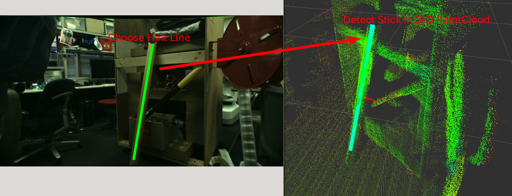

# HintedStickFinder

Detect a stick from pointcloud and line in 2-D image as hiint.

## Subscribing Topic
* `~input` (`sensor_msgs/PointCloud2`)

  Input pointcloud

* `~input/camera_info` (`sensor_msgs/CameraInfo`)

  Camera parameter where hint line is defined

* `~input/hint/line` (`geometry_msgs/PolygonStamped`)

  Hint line described in 2-D image.

## Publishing Topic
* `~debug/line_filtered_indices` (`pcl_msgs/PointIndices`)

  Indices of input pointcloud which is filtered by hint line.

* `~debug/line_filtered_normal` (`sensor_msgs/PointCloud`)

  Normal pointcloud of filtered pointcloud.

* `~debug/cylinder_marker` (`visualization_marker/Marker`)

  Marker topic to visualize detected stick

* `~debug/cylinder_pose` (`geometry_msgs/PoseStamped`)

  Pose of detected stick.

* `~output/inliers` (`pcl_msgs/PointIndices`)

  Inliers of detected stick.
* `~output/coefficients` (`pcl_msgs/ModelCoefficients`)

  Coefficients of detected stick. The coefficients are
  `[cx, cy, cz, dx, dy, dz, r, h]`.

## Parameters
* `~min_radis` (Double, default: `0.05`)
* `~max_radis` (Double, default: `0.2`)

  Minium and maximum radius of cylinder fitting.

* `~filter_distance` (Double, default: `0.2`)

  Distance from hint line to points which cna be candidate.

* `~outlier_threshold` (Double, default: `0.01`)

  Outlier threshold in cylinder fitting.

* `~max_iteration` (Integer, default: `100`)

  Maximum number of iteraoitn in cylinder fitting

* `~min_probability` (Integer, default: `0.8`)

  Required minimum probability of cylinder fitting

* `~cylinder_fitting_trial` (Integer, default: `3`)

  The number of cylinder fitting trials when no cylinder is found

* `~min_inliers` (Integer, default: `10`)

  Minimum number of inliers in cylinder fitting.

* `~eps_2d_angle` (Double, default: `0.1`)

  Threshold between hint line and detected stick. This evaluation is done in 2-D coordinate system.

* `~not_synchronize` (Boolean, default: `False`)

  Do not synchronize `~input`, `~input/camera_info` and `~input/hint/line` if this parameter is `True`.
  `~input/camera_info` and `~input/hint/line` are stored in nodelet and latest of the messages are used for new `~input` pointcloud.
* `~use_normal` (Boolean, default: `False`)

  Do not run normal estimation inside of the nodelet and use normal fields of `~input` are used.
