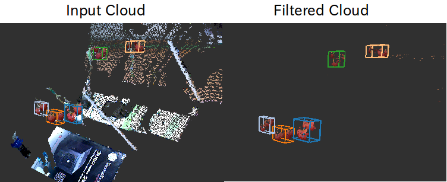

# HSIColorFilter

Filter pointcloud based on HSI range.

## Subscribing Topic
* `~input` (`sensor_msgs/PointCloud2`)

  Input pointcloud. rgb field is required.

* `~indices` (`pcl_msgs/PointIndices`)

  Indices of pointcloud. only available if `~use_indices` is true.

## Publishing Topic
* `~output` (`sensor_msgs/PointCloud2`)

  Filtered pointcloud.

* `~color_space` (`sensor_msgs/PointCloud2`)

  Color space visualization for debugging

## Parameters
* `~h_max` (Integer, default: `127`)
* `~h_min` (Integer, default: `-128`)
* `~s_max` (Integer, default: `255`)
* `~s_min` (Integer, default: `0`)
* `~i_max` (Integer, default: `255`)
* `~i_min` (Integer, default: `0`)

   Color range to filter.
