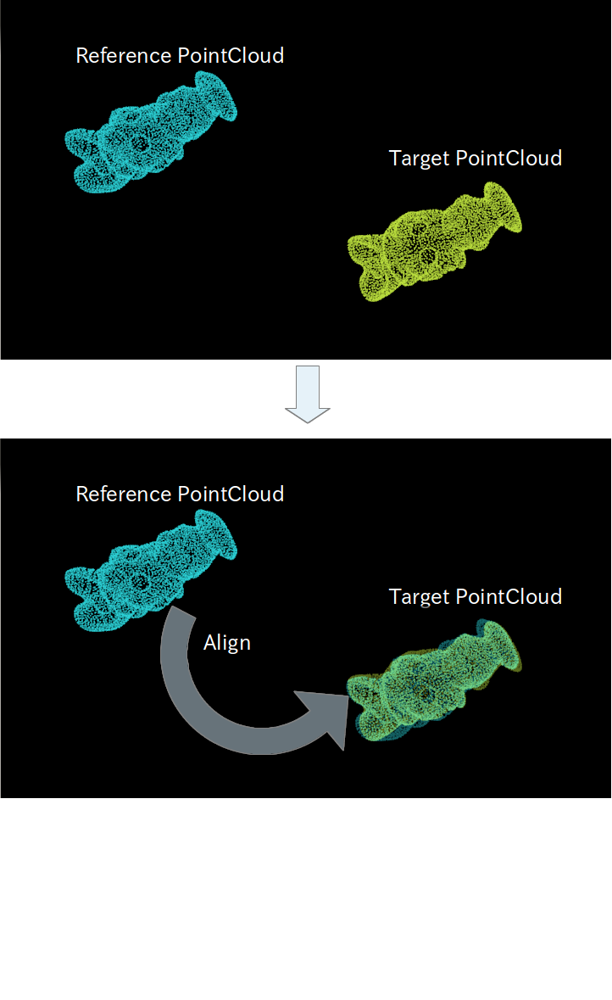
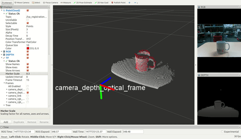
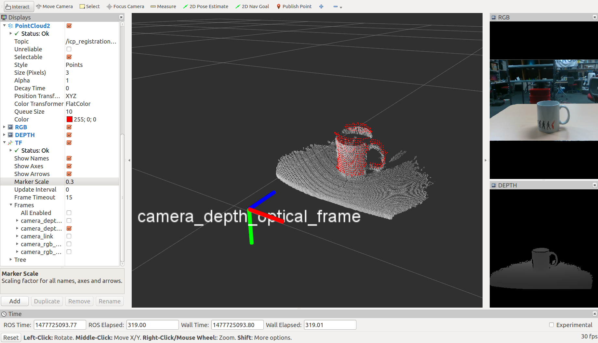
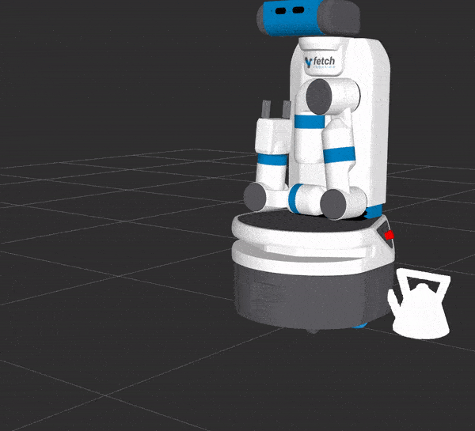

# ICPRegistration




Register two pointclouds based on icp like registration technique.

## Subscribing Topics
* `~input` (`sensor_msgs/PointCloud2`)

  Target pointcloud.
* `~input/camera_info` (`sensor_msgs/CameraInfo`)

  Camera info.
  This topic is always subscribed but needed only when `~correspondence_algorithm` == `Projective (1)`.

* `~input_reference` (`sensor_msgs/PointCloud2`)

  Reference pointcloud. frame_id of this pointlcoud is ignored.

  This topic is subscribed only when `~synchronize_reference` is false.
  Only one of `~input_reference` and `~input_reference_array` can be used.

* `~input_reference_array` (`jsk_recognition_msgs/PointsArray`)

  Array of reference pointcloud. `ICPRegistration` uses the reference
  which provides the best fitting score.

  This topic is subscribed only when `~synchronize_reference` is false.
  Only one of `~input_reference` and `~input_reference_array` can be used.

* `~input_reference_add` (`sensor_msgs/PointCloud2`)

  Reference pointcloud in addition to `~input_reference` or `~input_reference_array`.

  This topic is subscribed only when `~synchronize_reference` is false.

* `~input_box` (`jsk_recognition_msgs/BoundingBox`)

  Bounding box to align pointcloud with.

  This topic is subscribed only when `~synchronize_reference` is false and `~align_box` is true.

* `~input_offset` (`geometry_msgs/PoseStamped`)

  Offset of pose.

  It will only be subscribed if `~synchronize_reference` is false and
  `~align_box` is false and `~use_offset_pose` is true.

* `~reference` (`sensor_msgs/PointCloud2`)

  Reference pointcloud.

  This topic is subscribed only when `~synchronize_reference` is true.


## Publishing Topics
* `~output` (`sensor_msgs/PointCloud2`)

  Reference pointcloud aligned with target pointcloud.

* `~output_pose` (`geometry_msgs/PoseStamped`)

  Result pose of alignment.

* `~debug/source` (`sensor_msgs/PointCloud2`)
* `~debug/target` (`sensor_msgs/PointCloud2`)
* `~debug/result` (`sensor_msgs/PointCloud2`)

  Pointcloud for debugging.

* `~debug/flipped` (`sensor_msgs/PointCloud2`)

  This topic is advertised but not published for now.

* `~icp_result` (`jsk_recognition_msgs/ICPResult`)

  Result pose of alignment with score and ID of best fitted reference pointcloud.

* `~output/latest_time` (`std_msgs/Float32`)

  latest computation time

* `~output/average_time` (`std_msgs/Float32`)

  average computation time


## Advertising Services
* `~icp_align` (`jsk_recognition_msgs/ICPAlign`)

  Service API of registration using target and reference pointcloud.

* `~icp_service` (`jsk_recognition_msgs/ICPAlignWithBox`)

  Service API of registration using target pointcloud and bounding box.

  Reference pointcloud should be stored in advance from `~input_reference`,
  `~input_reference_array` or `~input_reference_add`.


## Parameters

### Parameters for subscribing topics
* `~synchronize_reference` (Bool, default: `false`)

  If true, `~input` and `~reference` will be subscribed with synchronization.

  If false, parameter `~align_box` and `~use_offset_pose` are enabled.
  Also, `~input_reference`, `~input_reference_array` and `~input_reference_add`
  will be subscribed separately.

* `~align_box` (Bool, default: `false`)

  If true, `~input` and `~input_box` will be subscribed with synchronization.

* `~use_offset_pose` (Bool, default: `false`)

  If `~align_box` is false and `~use_offset_pose` is true,
  `~input` and `~input_offset` will be subscribed with synchronization.

  If both of `~align_box` and `~use_offset_pose` are false, `~input` will be subscribed.

### Parameters for ICP alignment
* `~use_normal` (Bool, default: `false`)

  Use normal information in registration.
  In order to use this feature, reference and target pointcloud should have
  valid normal fields.

* `~transform_3dof` (Bool, default: `false`)

  Add constraint to transform estimation on 3D (1D rotation + 2D translation) from header frame of input cloud.
  See `TfTransformCloud` to change header frame of point cloud.

  

Parameters below can be changed by `dynamic_reconfigure`.

* `~algorithm` (Int, default: `0`)

  Should be one of `ICP (0)`, `GICP (1)` or `NDT (2)`.

* `~correspondence_algorithm` (Int, default: `0`)

  Should be one of `NN (0)` or `Projective (1)`.

* `~max_iteration` (Int, default: `100`)

  Maximum iterations of ICP alignment.

* `~correspondence_distance` (Float, default: `10`)

  Maximum correspondence distance in meters.

* `~transform_epsilon` (Float, default: `1e-9`)

  Maximum allowable difference between two consecutive transformations
  for an optimization to be considered as having converged to the final solution.

* `~euclidean_fittness_epsilon` (Float, default: `0.01`)

  Maximum allowed Euclidean error between two consecutive steps in the ICP loop,
  before the algorithm is considered to have converged.

* `~ransac_iterations` (Int, default: `1000`)

  Number of iterations RANSAC should run for.

* `~ransac_outlier_threshold` (Float, default: `0.05`)

  Outlier distance threshold for the internal RANSAC outlier rejection loop.

* `~rotation_epsilon` (Float, default: `2e-3`)

  Maximum allowable difference between two consecutive rotations
  for an optimization to be considered as having converged to the final solution.

  This parameter is used only when `~algorithm` is `GICP (1)`.

* `~correspondence_randomness` (Int, default: `20`)

  Number of neighbors used when selecting a point neighborhood to compute covariances.

  This parameter is used only when `~algorithm` is `GICP (1)`.

* `~maximum_optimizer_iterations` (Int, default: `20`)

  Maximum number of iterations at the optimization step.

  This parameter is used only when `~algorithm` is `GICP (1)`.

* `~ndt_resolution` (Float, default: `1.0`)
* `~ndt_step_size` (Float, default: `0.05`)
* `~ndt_outlier_ratio` (Float, default: `0.35`)

  These parameters are not used for now.

### Other parameters
* `~use_flipped_initial_pose` (Bool, default: `true`)

  Whether to consider flipped initial pose.


## Sample Launch

```
roslaunch jsk_pcl_ros sample_icp_registration.launch
```
