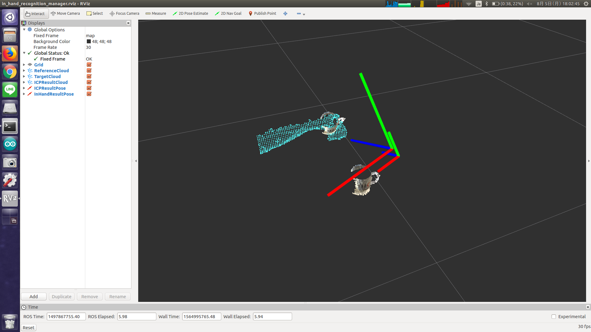

# in_hand_recognition_manager.py



## What Is This

This node concatenate transformations for recognizing object in hand.

## Subscribing Topic

* `~input` (`geometry_msgs/PoseStamped`)

  Teacher pose.

* `~input/result` (`geometry_msgs/PoseStamped`)

  Difference pose.


## Publishing Topic

* `~output` (`geometry_msgs/PoseStamped`)

  Concatenated transformations.

* `~output/recognition` (`geometry_msgs/PoseStamped`)

  This topic is just a relay of `~input`.


## Sample

```bash
roslaunch jsk_pcl_ros sample_in_hand_recognition_manager.launch
```
