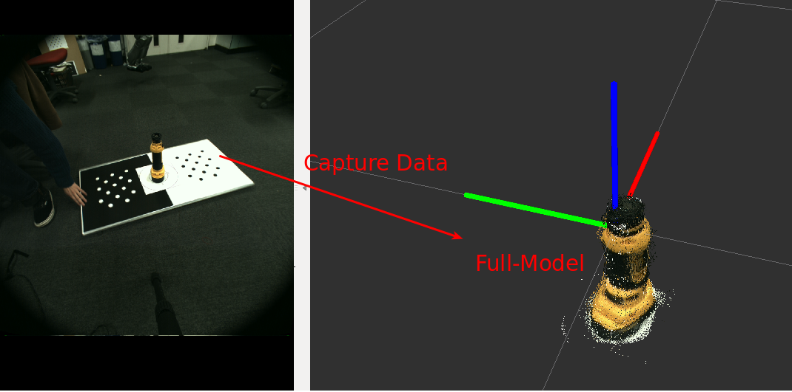

# IncrementalModelRegistration
## What Is This


Build a full-model from sequential captured data.

## Subscribing Topic
* `~input` (`sensor_msgs/PointCloud2`)

  Input pointcloud. RGB field is required.
* `~input/pose` (`geometry_msgs/PoseStamped`)

  Initial pose to estimate acculate pose of the pointcloud.
* `~input/indices` (`pcl_msgs/PointIndices`)

  Indices to mask object in `~input` pointcloud.

## Publishing Topic
* `~output/non_registered` (`sensor_msgs/PointCloud2`)

  Pointcloud just concatenated according to `~input/pose`

* `~output/registered` (`sensor_msgs/PointCloud2`)

  Pointcloud refined by ICP.

## Internally Using Services
* `~icp_service` (`jsk_recognition_msgs/ICPAlign`)

  ICP service interface to refine model.

## Advertising Services
* `~start_registration` (`std_srvs/Empty`)

  Trigger to start registration.

## Parameters
* `~frame_id` (String, default: `multisense/left_camera_optical_frame`)

  Frame ID used for output topics.

## Sample

```bash
roslaunch jsk_pcl_ros sample_incremental_model_registration.launch
```
