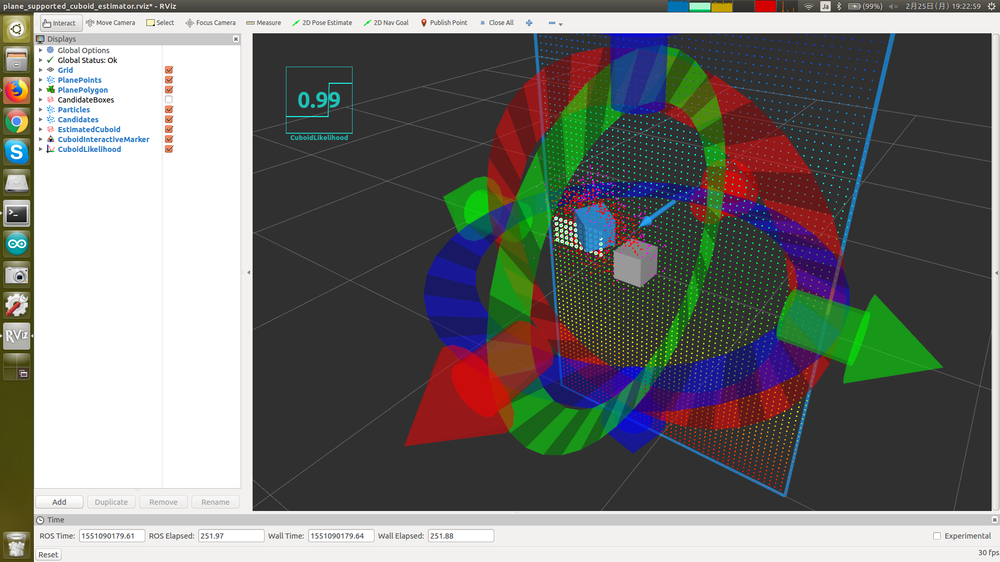

# InteractiveCuboidLikelihood

## What Is This


Compute cuboid likelihood at given point.


## Subscribing Topic

* `~input` (`sensor_msgs/PointCloud2`)

  Input point cloud.


## Publishing Topic

* `~output` (`std_msgs/Float32`)

  Cuboid likelihood.


## Parameter

* `~frame_id` (String, default: `odom`)

  Frame ID of interactive marker, which is generated internally.

* `~sensor_frame` (String, default: `odom`)

  Frame ID of sensor.

* `~initial_pos` (List of Float, default: `[0, 0, 0]`)

  Initial x, y, z of interactive marker in meters.

* `~initial_rot` (List of Float, default: `[0, 0, 0]`)

  Initial roll, pitch, yaw of interactive marker in radians.

Parameters below can be changed by `dynamic_reconfigure`.

* `~dx` (Float, default: `0.1`)
* `~dy` (Float, default: `0.1`)
* `~dz` (Float, default: `0.1`)

  Dimension of interactive marker in meters.

* `~use_range_likelihood` (Bool, default: `False`)

  Set to true if you want to update likelihood based on geometry respected to plane.

* `~range_likelihood_local_min_z` (Float, default: `0.0`)
* `~range_likelihood_local_max_z` (Float, default: `0.0`)

  Allowed minimum and maximum distance from plane in meters.

* `~outlier_distance` (Float, default: `0.1`)

  Threshold to regard points as inlier in meters.

* `~min_inliers` (Int, default: `10`)

  Minimum number of inliers.

* `~use_occulusion_likelihood` (Bool, default: `False`)

  Set to true if you want to take occlusion into acount when compute likelihood.

* `~plane_distance_error_power` (Float, default: `2.0`)

  Power used for computing error at each candidate point.

* `~use_inside_points_distance_zero` (Bool, default: `False`)

  Set to true if you want to treat plane inside points as distance = 0.

  This parameter is used when `~use_occulusion_likelihood` is false.

* `~expected_density` (Float, default: `0.01`)

  Expected average side in meters of cuboid one point occupies.

* `~use_inliers` (Bool, default: `False`)

  Set to true if you want to take inlier likelihood into account.

* `~inliers_power` (Float, default: `2.0`)

  Power used for computing inlier likelihood.

  This parameter is used when `~use_inliers` is true.

* `~use_support_plane_angular_likelihood` (Bool, defalut: `False`)

  Set to true if you want to take angular likelihood of support plane into account.

* `~support_plane_angular_likelihood_weight_power` (Float, default: `1.0`)

  Power used for computing angular likelihood of support plane.

  This parameter is used when `~use_support_plane_angular_likelihood` is true.

* `~use_surface_area_likelihood` (Bool, default: `False`)

  Set to true if you want to take surface area likelihood into account.

* `~surface_area_error_power` (Float, default: `1.0`)

  Power used for computing surface area likelihood.

* `~use_polygon_likelihood` (Bool, default: `False`)

  Set to true if you want to take polygon likelihood into account.


## Sample

```bash
roslaunch jsk_pcl_ros sample_plane_supported_cuboid_estimator.launch
```
