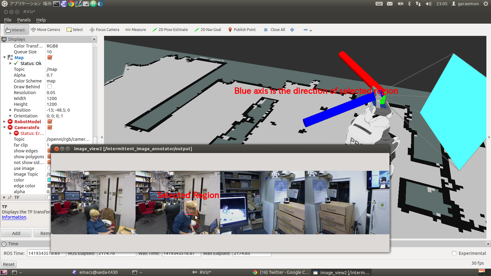
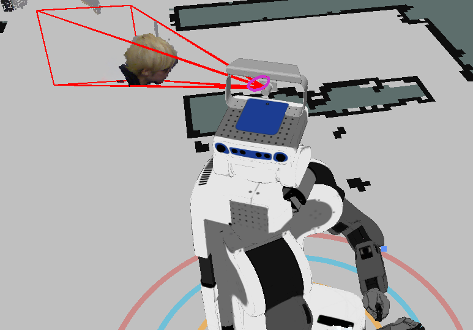

# IntermittentImageAnnotator
## What Is This



1. Store images when `~shutter` service is called
2. Publish snapshots as one concatenated image
3. Subscribe `~output/screenrectangle` to get ROI.
4. Publish ROI information to `~output` namespace.
5. Publish pointcloud inside of the ROI to `~output/cloud` if `~store_pointcloud` is set

## Subscribing Topic
* `~input/image` and `~input/camera_info` (`sensor_msgs/Image` and `sensor_msgs/CameraInfo`)

  Input image and camera info.

* `~input/cloud` (`sensor_msgs/PointCloud2`)

  Input pointcloud to be clipped by specified ROI.

* `~output/screenrectangle` (`geometry_msgs/PolygonStamped`)

  ROI. We expect to use [image_view2](https://github.com/jsk-ros-pkg/jsk_common/tree/master/jsk_ros_patch/image_view2).

## Publishing Topic
* `~output` (`sensor_msgs/Image`)

  Snapshots as one concatenated image.

* `~output/direction` (`geometry_msgs/PoseStamped`)

  Direction of ROI as `PoseStamped`. z-axis directs the center of ROI.

* `~output/roi` (`jsk_recognition_msgs/PosedCameraInfo`)

  Publish ROI of specified region as `PosedCameraInfo`.

* `~output/cloud` (`sensor_msgs/PointCloud2`)

  Pointcloud inside of ROI. pointcloud is stored when `~shutter` service is called and
  its timestamp will be updated according to the latest image.

* `~output/marker` (`visualization_msgs/Marker`)

  Marker to visualize ROI (`~output/roi`).

## Parameters
* `~fixed_frame_id` (`String`, default: `odom`)

  Fixed frame id to resolve tf.

* `~max_image_buffer` (`Integer`, default: `5`)

  The maximum number of images to store in this nodelet.

* `~rate` (`Float`, default: `1.0`)

  Publishing rate of concatenated images in [Hz].

* `~store_pointcloud` (`Boolean`, default: `false`)

  Store pointcloud if it's true

* `~keep_organized` (`Boolean`, default: `false`)

  Keep pointcloud organized after clipping by specified ROI.

## Advertising Service

* `~shutter` (`std_srvs/Empty`)

  Take a snapshot

* `~clear` (`std_srvs/Empty`)

  Clear images stored in the nodelet.

* `~request` (`std_srvs/Empty`)

  Request publishing concatenated image to `~output`.

## Sample

```bash
roslaunch jsk_pcl_ros sample_intermittent_image_annotator.launch
```
