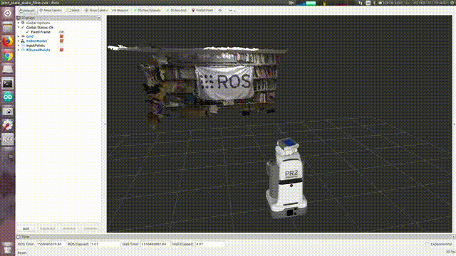

# JointStateStaticFilter

## What Is This


Pass through input point cloud only when specified robot joints are static.


## Subscribing Topic

* `~input` (`sensor_msgs/PointCloud2`)

  Input point cloud to which you want to apply this filter.

* `~input_joint_state` (`sensor_msgs/JointState`)

  Input joint state of the robot.


## Publishing Topic

* `~output` (`sensor_msgs/PointCloud2`)

  Filtered point cloud.


## Parameter

* `~joint_names` (List of String, default: `[]`)

  Target joint list to check if static.

  If no joint is specified, this node does not publish anything.


## Sample

```bash
roslaunch jsk_pcl_ros sample_joint_state_static_filter.launch
```
