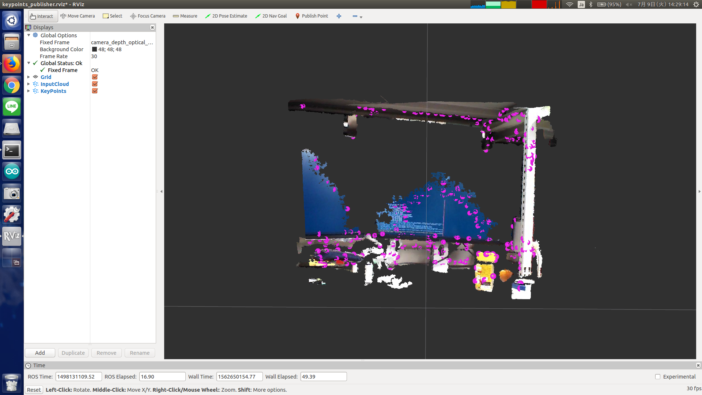

# KeypointsPublisher



## What Is This

This nodelet will calculate the NARF keypoints and publish.


## Subscribing Topic

* `~input` (`sensor_msgs/PointCloud2`)

  Input point cloud.
  Point type should be `pcl::PointXYZ`.

  The point cloud should be organized.


## Publishing Topic

* `~nerf_keypoints` (`sensor_msgs/PointCloud2`)

  Point cloud of keypoints.


## Parameters

None.


## Sample

```bash
roslaunch jsk_pcl_ros sample_keypoints_publisher.launch
```
