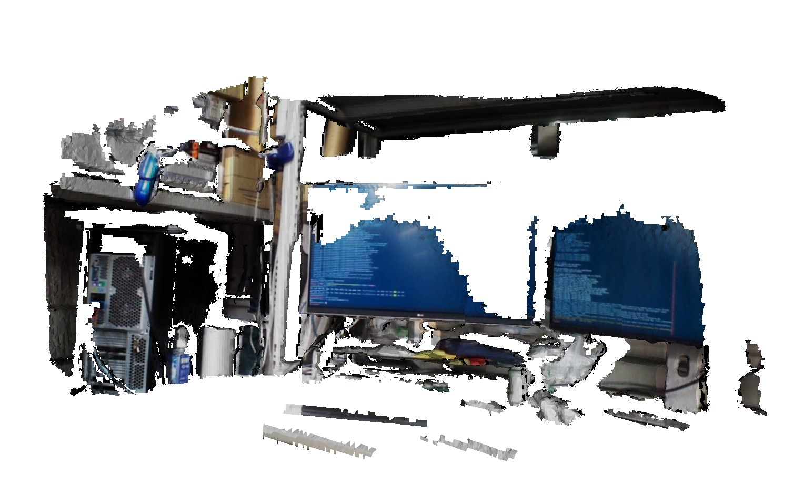

# Kinfu


Use kinfu (kinect fusion) for model generation and SLAM.

## Note

Kinfu is available only with CUDA enabled PCL. 

Please see [here](../../install_pcl_from_source.md) for more information.

## Subscribing Topics

* `~input/camera_info` (`sensor_msgs/CameraInfo`)

  Intrinsic camera parameter of depth image

* `~input/depth` (`sensor_msgs/Image`)

  Input depth image.

* `~input/color` (`sensor_msgs/Image`)

  RGB color image (subsribed if `~integrate_color` is `true`).


## Publishing Topics

* `~output` (`geometry_msgs/PoseStamped`)

  Pose of camera

* `~output/cloud` (`sensor_msgs/PointCloud2`)

  Generated point cloud of kinfu model.

* `~output/depth` (`sensor_msgs/Image`)

  Generated depth of kinfu model in current camera view.

* `~output/rendered_image` (`sensor_msgs/Image`)

  Rendered image of kinfu model in current camera view.

* `~output/status` (`jsk_recognition_msgs/TrackerStatus`)

  Status of icp tracking. Succeeding or lost.


## Advertising Services

* `~reset` (`std_srvs/Empty`)

  Reset tracking and mapping of kinfu.

* `~save_mesh` (`std_srvs/Empty`)

  Convert tsdf to mesh using marching cubes algorithm, saved `mesh.obj` under `~save_dir`.


## Parameters

* `~queue_size` (Int, default: `10`)

  Size of message queue for synchronization.

* `~auto_reset` (Boolean, default `true`)

  Flag to auto reset if ICP tracking is lost.

* `~integrate_color` (Boolean, default: `false`)

  Flag to integrate color for tracking and mapping.
  If `true`, `~input/color` is also Subscribed.

* `~slam` (Boolean, default: `false`)

  Flag to publishing tf `map` relative to `~fixed_frame_id`.

* `~fixed_frame_id` (String, default: `odom_init`)

  Used when `~slam` is `true`.

* `~save_dir` (String, default: `.`)

  Save directory for mesh and texture images.

* `~n_textures` (Int, default: `-1`)

  The number of textures to be used to create texture mesh with below logics:
    - `-1`: all textures are used and texture mesh is saved
    - `0`: no textures are used and polygon mesh is saved
    - `>0`: `n_textures_` textures are used and texture mesh is saved

* `~volume_size` (Float, default: `3.0`)

  TSDF Volume size for Kinect Fusion.


## Sample


### Without SLAM

```bash
roslaunch jsk_pcl_ros sample_kinfu.launch
rosservice call /kinfu/save_mesh  # saves mesh model below
rosservice call /save_mesh_server/request  # saves mesh with context (bbox)
```




## With SLAM

```bash
gdown https://drive.google.com/uc?id=0B9P1L--7Wd2vMDA4NW9YSEpoczQ -O $(rospack find jsk_pcl_ros)/sample/data/hrp2_apc_2016-07-27-22-08-02.bag
export ROBOT=HRP2JSKNTS
# you need to resolve dependencies on private projects here to see robot model on rviz.
roslaunch jsk_pcl_ros sample_kinfu_hrp2_apc.launch
```

<div class="text-center">
  <iframe src="https://drive.google.com/file/d/0B9P1L--7Wd2vWjJWbU9rQlE4bUE/preview?autoplay=1" width="640" height="350" frameborder="0"></iframe>
</div>
