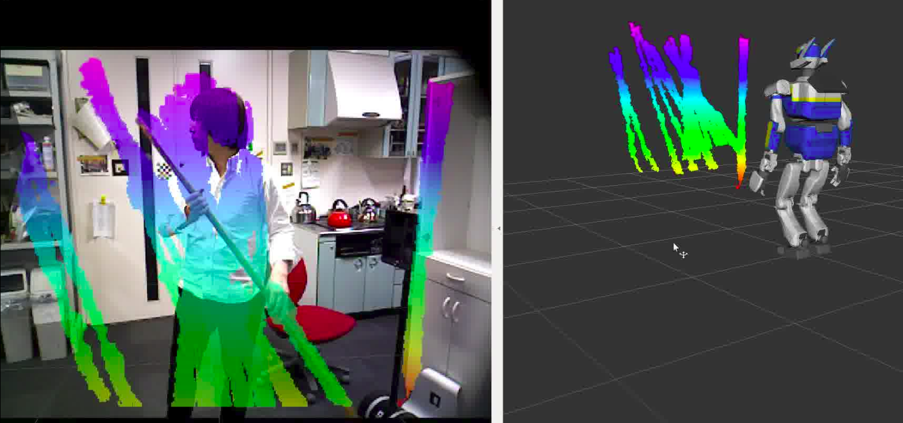

LineSegmentCollector
======================

What is this?
-------------

Collect line segments.

Subscribing Topics
------------------

- ``~input`` (``sensor_msgs/PointCloud2``)

  Input pointcloud.

- ``~input_indices`` (``jsk_recognition_msgs/ClusterPointIndices``)

  Cluster point indices of lines.

- ``~input_coefficients`` (``jsk_recognition_msgs/ModelCoefficientsArray``)

  Coefficients of lines.

- ``~trigger`` (``jsk_recognition_msgs/TimeRange``)

  Trigger for resetting collected line segments buffer.

  Only ``start`` field will be used.

Publishing Topics
-----------------

- ``~output/cloud`` (``sensor_msgs/PointCloud2``)

  Pointcloud of collected line segments.

- ``~output/coefficients`` (``jsk_recognition_msgs/ModelCoefficientsArray``)
- ``~output/inliers`` (``jsk_recognition_msgs/ClusterPointIndices``)
- ``~output/polygons`` (``jsk_recognition_msgs/PolygonArray``)

  These topics are advertised but not published for now.

- ``~debug/connect_segments/inliers`` (``jsk_recognition_msgs/ClusterPointIndices``)

  Connected inliers of collected lines.

Parameters
----------

- ``~rotate_type`` (``String``, default: ``tilt_two_way``)

  This parameter is not used for now.

- ``~segment_connect_normal_threshold`` (``Double``, default: ``0.9``)

  Threshold of dot product of normal to connect clusters.

- ``~ewma_tau`` (``Double``, default: ``0.2``)

  Tau parameter of EWMA to connect clusters.

- ``~outlier_threshold`` (``Double``, default: ``0.01``)

  This parameter is not used for now.

Sample
------

.. code-block:: bash

  roslaunch jsk_pcl_ros sample_line_segment_collector.launch
