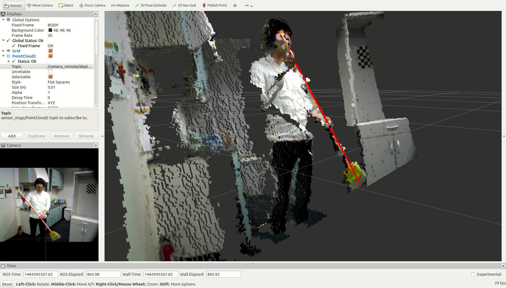

LineSegmentDetector
=====================

What is this?
--------------

Detect lines in a point cloud.

Subscribing Topics
--------------------

- ``~input`` (``sensor_msgs/PointCloud2``)

  Input point cloud.

- ``~input_indices`` (``jsk_recognition_msgs/ClusterPointIndices``)

  Input indices of the cluster in a point cloud.

Publishing Topics
-------------------

- ``~debug/line_marker`` (``visualization_msgs/Marker``)

  Marker topic to visualize detected line.

- ``~output/inliers`` (``jsk_recognition_msgs/ClusterPointIndices``)

- ``~output/coefficients`` (``jsk_recognition_msgs/ModelCoefficientsArray``)

  Result of detection.

Parameters
-----------

- ``~approximate_sync`` (``Bool``, default: ``false``)

  Whether to allow approximate synchronization of input topics.

- ``~method_type`` (``Int``, default: ``0``)

  The type of sample consensus method to use.

  - 0: SAC_RANSAC
  - 1: SAC_LMEDS
  - 2: SAC_MSAC
  - 3: SAC_RRANSAC
  - 4: SAC_RMSAC
  - 5: SAC_MLESAC
  - 6: SAC_PROSAC

- ``~outlier_threshold`` (``Double``, default: ``0.005``)

  Outlier threshold in meters to detect plane using RANSAC.

- ``~max_iterations`` (``Int``, default: ``1000``)

  Maximum iteration number to detect larger plane using RANSAC.

- ``~min_indices`` (``Int``, default: ``1000``)

  Minimum number of points which construct a line.

- ``~min_length`` (``Double``, default: ``0.1``)

  Minimum length of each line in meters.

- ``~line_width`` (``Double``, default: ``0.01``)

  Width of line marker published to ``~debug/line_marker``.

Sample
------

.. code-block:: bash

  roslaunch jsk_pcl_ros sample_line_segment_detector.launch
