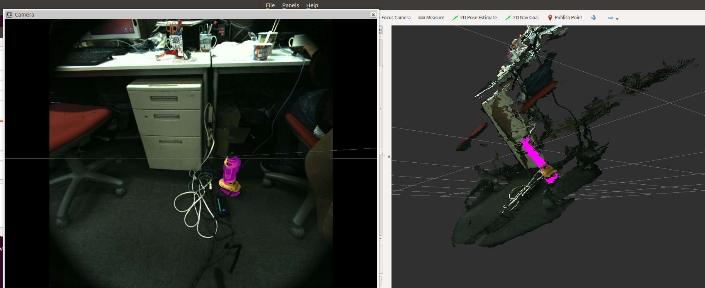

# LINEMODDetector
## What Is This


A nodelet to detect object using LINEMOD.

## Subscribing Topic
* `~input` (`sensor_msgs/PointCloud2`)

  Input pointcloud.

## Publishing Topic
* `~output` (`sensor_msgs/PointCloud2`)

  Result of detection as pointcloud.

* `~output/mask` (`sensor_msgs/Image`)

  Result of detection as mask image.

* `~output/pose` (`geometry_msgs/PoseStamped`)

  Pose of detected template

* `~output/template` (`sensor_msgs/PointCloud2`)

  Template pointcloud at identity pose.

## Parameters
* `~template_file` (`String`, default: `template`)

  Path to template files (`.pcd` and `_poses.yaml`).

  e.g.) If the templates are `/foo/bar.pcd` and `/foo/bar_poses.yaml`,
  then this parameter should be `/foo/bar`.

* `~gradient_magnitude_threshold` (`Double`, default: `10.0`)

  Gradient magnitude threshold

* `~detection_threshold` (`Double`, default: `0.75`)

  Detection threshold

## Sample

```
roslaunch jsk_pcl_ros sample_linemod_detector.launch
```
