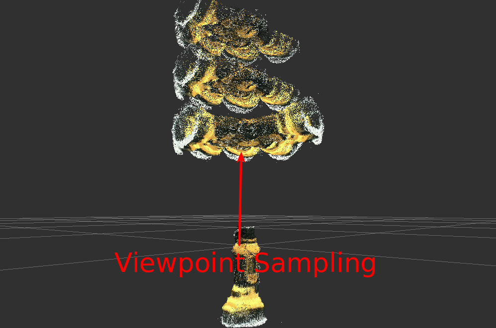

# LINEMODTrainer
## What Is This



A nodelet to train LINEMOD data from pointcloud and indices to mask the objects.
This nodelet stores data of pointcloud and if you call `~start_training` service,
it will train the data and dump the templates into lmt file.

## Subscribing Topic
* `~input` (`sensor_msgs/PointCloud2`)

  This pointcloud should be able to be converted into `pcl::PointXYZRGBA` data.

* `~input/indices` (`pcl_msgs/PointIndices`)

  Indices to mask object in `~input` pointcloud.

* `~input/info` (`sensor_msgs/CameraInfo`)

  Camera parameter to sample viewpoint.

## Publishing Topic
* `~output/range_image` (`sensor_msgs/Image`)
* `~output/colored_range_image` (`sensor_msgs/Image`)
* `~output/sample_cloud` (`sensor_msgs/PointCloud2`)

  Image and pointcloud generated by viewpoint sampling.

## Advertising Servicies
* `~start_training` (`std_srvs/Empty`)

  Start training and dump result into a file.

* `~clear` (`std_srvs/Empty`)

  Clear stored data.

## Parameters
* `~output_file` (`String`, default: `template`)

   A file path to dump trained data.

   e.g.) If this parameter is set to `/foo/bar`, then `/foo/bar.linemod`,
   `/foo/bar.pcd` and `/foo/bar_poses.yaml` will be created.

* `~sample_viewpoint` (`Bool`, default: `True`)

  Generate training data by samplingenerating viewpoint if this parameter is set to true.

* `~sample_viewpoint_angle_step` (`Double`, default: `40.0`)
* `~sample_viewpoint_angle_min` (`Double`, default: `-80.0`)
* `~sample_viewpoint_angle_max` (`Double`, default: `80.0`)
* `~sample_viewpoint_radius_step` (`Double`, default: `0.2`)
* `~sample_viewpoint_radius_min` (`Double`, default: `0.4`)
* `~sample_viewpoint_radius_max` (`Double`, default: `0.8`)

  Viewpoint sampling parameters. Pose of model is sampled by golden ratio spatial technique.

* `~n_points` (`Int`, default: `150`)

  Number of viewpoint set.

## Sample

```bash
roslaunch jsk_pcl_ros sample_linemod_trainer.launch
```
