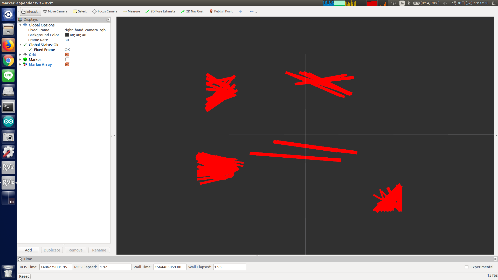

# marker_appender.py



Concatenate all subscribed `visualization_msgs/Marker` into one `visualization_msgs/MarkerArray`.

## Subscribing Topics

* `marker` (`visualization_msgs/Marker`)

  Marker.


## Publishing Topics

* `marker_array` (`visualization_msgs/MarkerArray`)

  Marker array.


## Sample

```bash
roslaunch jsk_pcl_ros sample_marker_appender.launch
```
