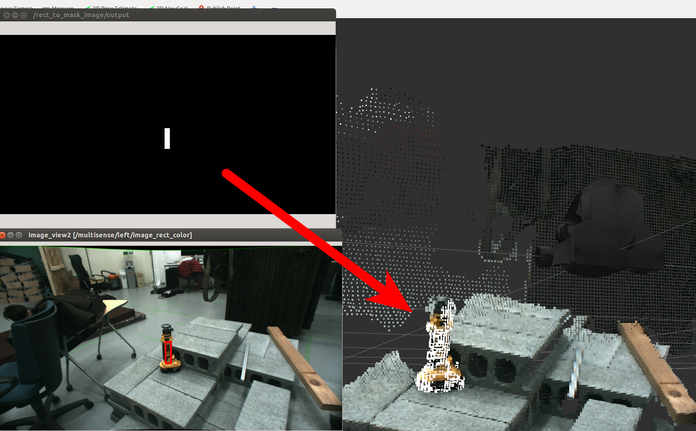

# MaskImageClusterFilter


Segment Clouds with mask_image and Clustering Methods(example. SuperVoxel).

## Subscribing Topic
* `~input` (`sensor_msgs/PointCloud2`)

  Input point cloud.

  It must be synchronized with `~target`.

* `~target` (`jsk_recognition_msgs/ClusterPointIndices`)

  Result of Some Clustering methods

* `~input/mask` (`sensor_msgs/Image`)

  Mask image which is used to filter the input segmented clusters.

* `~input/camera_info` (`sensor_msgs/CameraInfo`)

  Camera parameters of the image.

## Publishing Topic
* `~output` (`pcl_msgs/PointIndices`)

  Indices of the points masked with `~input/mask` and `~target`.

## Parameters

None.

## Sample

```bash
roslaunch jsk_pcl_ros sample_mask_image_cluster_filter.launch
```
