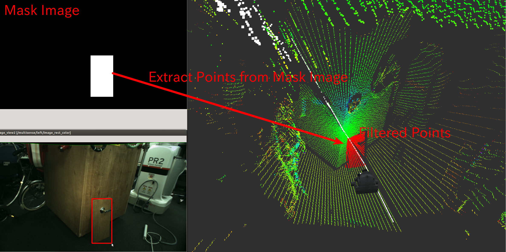

# MaskImageFilter


Extract indices of pointcloud which is masked by mask image. The pointcloud is no need to be organized.

## Subscribing Topic
* `~input` (`sensor_msgs/PointCloud2`)

  Input point cloud to be filtered.

* `~input/mask` (`sensor_msgs/Image`)

  Mask image.

* `~input/camera_info` (`sensor_msgs/CameraInfo`)

  Camera parameters of the mask image.

## Publishing Topic
* `~output` (`pcl_msgs/PointIndices`)

  Indices of the points masked by `~input/mask`.

## Parameters
* `~negative` (Bool, default: `false`)

  Flip the max region of mask image or not.

## Sample

```bash
roslaunch jsk_pcl_ros sample_mask_image_filter.launch
```
