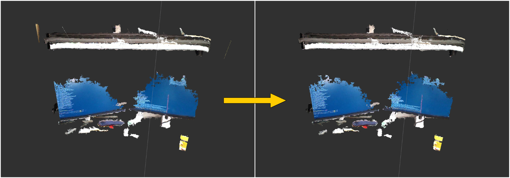

# MovingLeastSquareSmoothing



## What Is This

This nodelet will subscribe point cloud, and publish smoothed one.
Please refer about MovingLeastSquare in
[http://pointclouds.org/documentation/tutorials/resampling.php](http://pointclouds.org/documentation/tutorials/resampling.php)

## Subscribing Topics
* `~input` (`sensor_msgs/PointCloud2`)

  Input pointcloud.

## Publishing Topics
* `~output` (`sensor_msgs/PointCloud2`)

  Smoothed pointcloud.

## Parameters
* `~gauss_param_set` (Boolean, default: `False`)

  Whether set gauss param or not

* `~search_radius` (Double, default: `0.03`)

  Nearest Neighbor Search param

* `~use_polynomial_fit` (Boolean, default: `False`)

  Whether use polynomial_fit or not

* `~polynomial_order` (Int, default: `2`)

  Set polynomial order

* `~calc_normal` (Boolean, default: `True`)

  calc_normal

## Sample

```bash
roslaunch jsk_pcl_ros sample_moving_least_square_smoothing.launch
```
