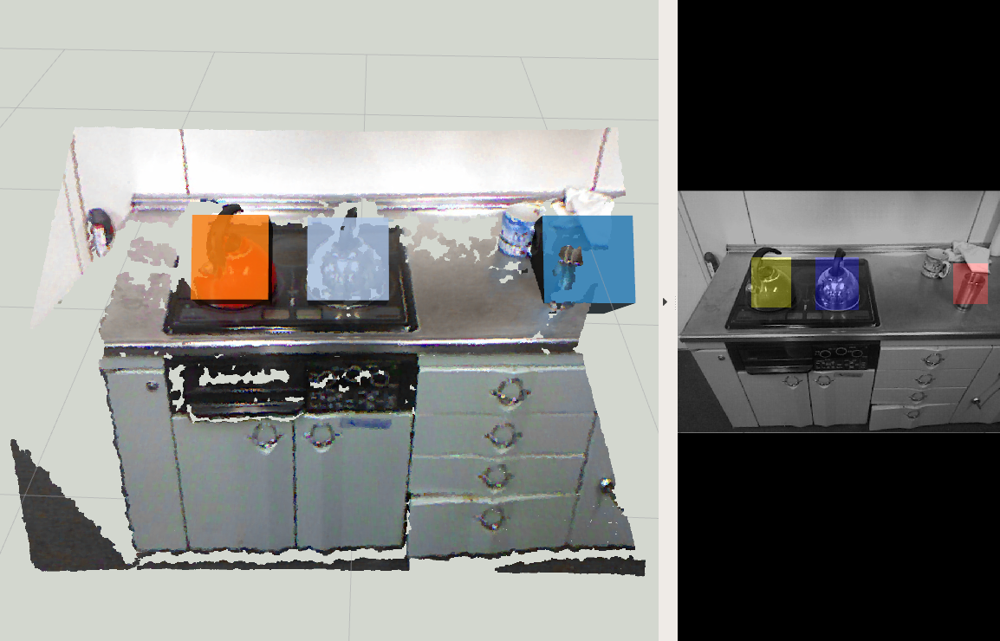

# MultiEuclideanClustering



## What is this?

Refine `ClusterPointIndices` by clustering with euclidean metrics.

## Subscribing Topic

* `~input` (`sensor_msgs/PointCloud2`)

  Original pointcloud.

* `~input/cluster_indices` (`jsk_recognition_msgs/ClusterPointIndices`)

  Original cluster point indices. `EuclideanClustering` is done for each cluster.

## Publishing Topic

* `~output` (`jsk_recognition_msgs/ClusterPointIndices`)

  Cluster point indices refined by clustering with euclidean metrics.

## Parameter

* `~tolerance` (Double, default: `0.02`):

   Max distance for the points to be regarded as same cluster.

* `~max_size` (Integer, default: `25000`)

   The maximum number of the points of one cluster.

* `~min_size` (Integer, default: `20`)

   The minimum number of the points of one cluster.

* `~downsample` (Bool, default `false`)

  Clustering with downsampled pointcloud or not.

* `~leaf_size` (Double, default `0.01`)

  Leaf size for downsampling. Used only when `~downsample` is `true`.

* `~approximate_sync` (Boolean, default: `false`):

   Policy of synchronization, if `false` it synchornizes exactly,
   else approximately.

* `~queue_size` (Int, default: `100`):

   Queue size of topic msgs for synchronization.

## Sample

```bash
roslaunch jsk_pcl_ros sample_multi_euclidean_clustering.launch
```
