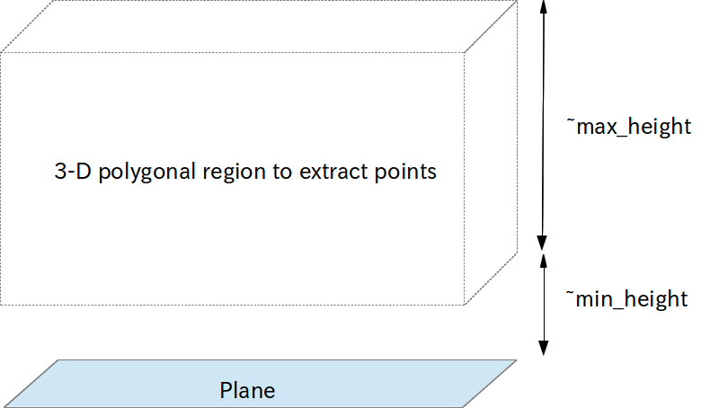

# MultiPlaneExtraction


Extract the points above the planes between `~min_height` and `~max_height`.

## Subscribing Topics
* `~input` (`sensor_msgs/PointCloud2`):

   Input pointcloud.
* `~indices` (`jsk_recognition_msgs/ClusterPointIndices`)
* `~input_polygons` (`jsk_recognition_msgs/PolygonArray`)
* `~input_coefficients` (`jsk_recognition_msgs/ModelCoefficientsArray`):

   The input planes.

   If `~use_indices` parameter is false, `~indices` is used.

   If `~use_coefficients` parameter is false, `~coefficients` is not used.
   (Instead `~use_sensor_frame` should be enabled in order to determine normal direction of planes.)

## Publishing Topics
* `~output` (`sensor_msgs/PointCloud2`):

   Pointcloud above the planes between `~min_height` and `~max_height`.
* `~output_nonplane_cloud` (`sensor_msgs/PointCloud2`):

   Pointcloud above the planes is not between `~min_height` and `~max_height`.
* `~output/indices` (`pcl_msgs/PointIndices`)

  PointIndices of points which are between `~min_height` and `~max_height`.

## Parameters
* `~keep_organized` (Bool, default: `True`)

   Keep organized point cloud or not.

* `~min_height` (Double, default: `0.0`)
* `~max_height`(Double, default: `0.5`)

   Minimum and maximum height of 3-D polygonal region to extract points.
* `~max_queue_size` (Integer, default: `100`)

   Queue length for subscribing topics.
* `~use_indices` (Bool, default: `True`)

   Use indices of planar regions to filter if it's set true.
   You can disable this parameter to filter pointcloud which is not the same pointcloud
   to segment planes
* `~magnify` (Double, default: `0.0`)

   Magnify planes by this parameter. The unit is m.
* `~use_async` (Boolean, default: `False`)

   Approximate sync input topics.
* `~use_coefficients` (Bool, default: `False`)

   Use coefficients topic to determine viewpoint.
   For avoiding plane flipping, either this parameter or `~use_sensor_frame` should be enabled.
* `~use_sensor_frame` (Boolean, default: `False`)

   Set viewpoint as a TF sensor frame.
   If this parameter is enabled, `~use_coefficients` is ignored and handled as `false`.
* `~sensor_frame` (String, default: `head_root`)

   Specify frame\_id of sensor origin.
   This parameter is enabled only when `~use_sensor_frame` is enabled.

## Issues

- Normal direction of planes

  Normal directions of each planes are computed as followings:

  |                             | __use_sensor_frame: false__        | __use_sensor_frame: true__             |
  |-----------------------------|------------------------------------|----------------------------------------|
  | __use_coefficients: false__ | PCL computes z-axis internally (it occurs flipping. warning shows up)   | Determine z-axis direction to TF frame |
  | __use_coefficients: true__  | Determine z-axis from coefficients topic | N/A (This condition is invalid. `~use_coefficients` is disabled in this case. Also warning shows up) |

  Both `~use_sensor_frame` and `~use_coefficients` is disabled by default,
  which means the normal directions are computed individually on every callback
  and can be flipped on the continuous time domain.

  Generally it's better to set either `~use_sensor_frame` or `~use_coefficients` as `true` for stable detection.

## Sample

```bash
roslaunch jsk_pcl_ros sample_multi_plane_extraction.launch
```
