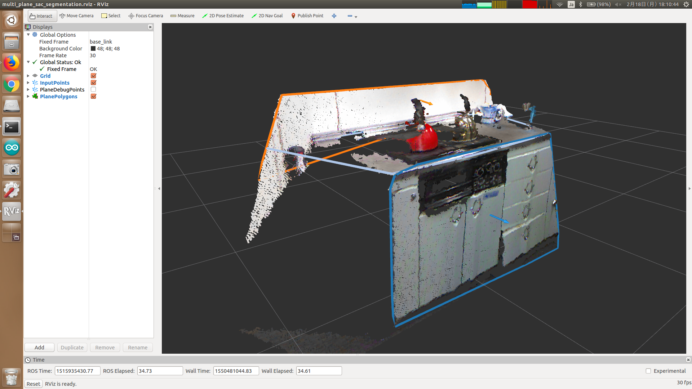

# MultiPlaneSACSegmentation

## What Is This


Segment planes from point cloud.

This node can be applied to unorganized point cloud.

If you have organized one, we recommend you to use `jsk_pcl/OrganizedMultiPlaneSegmentation` for faster segmentation.


## Subscribing Topic

* `~input` (`sensor_msgs/PointCloud2`)

  Input point cloud.

* `~input_normal` (`sensor_msgs/PointCloud2`)

  Input point cloud which contains normal for each point.

* `~input_clusters` (`jsk_recognition_msgs/ClusterPointIndices`)

  Input clusters for each of which planes are segmented.

* `~input_imu` (`sensor_msgs/Imu`)

  Input IMU.

  `linear_acceleration` field is used for plane segmentation.

  Please see `~use_imu_parallel` and `~use_imu_perpendicular`.


## Publishing Topic

* `~output_indices` (`jsk_recognition_msgs/ClusterPointIndices`)

  Plane indices.

* `~output_coefficients` (`jsk_recognition_msgs/ModelCoefficientsArray`)

  Normal coefficients of each plane.

* `~output_polygons` (`jsk_recognition_msgs/PolygonArray`)

  Plane Polygons.


## Parameter

* `~use_normal` (Bool, default: `False`)

* `~use_clusters` (Bool, default: `False`)

* `~use_imu_parallel` (Bool, default: `False`)

* `~use_imu_perpendicular` (Bool, default: `False`)

If `~use_normal` is set to True, `~input_normal` will be subscribed.

If either `~use_imu_parallel` or `~use_imu_perpendicular` is set to True, `~input_imu` will be subscribed.

`~use_imu_parallel` should be enabled when you want to determine a plane parallel to the linear_acceleration axis.

On the other hand, `~use_imu_perpendicular` should be enabled when you want to determine a plane perpendicular to the linear_acceleration axis.

`~use_clusters` can be enabled when none of paramters above is enabled, and then `~input_clusters` will be subscribed.

So, the possible input patterns are below:

  1. `~input`, `~input_normal`, `~input_imu`

  2. `~input`, `~input_normal`

  3. `~input`, `~input_imu`

  4. `~input`, `~input_clusters`

  5. `~input`

* `~outlier_threshold` (Float, default: `0.01`)

  Distance threshold in meters to remove outliers.

  This parameter can be changed by `dynamic_reconfigure`.

* `~max_iterations` (Int, default: `1000`)

  Maximum number of iterations in plane segmentation.

  This parameter can be changed by `dynamic_reconfigure`.

* `~min_inliers` (Int, default: `5000`)

  Minimum number of points you allow about segmented planes.

  This parameter can be changed by `dynamic_reconfigure`.

* `~min_points` (Int, default: `1000`)

  Minimum total number of outliers in each segmentation used for defining inputs at next loop.

  This parameter can be changed by `dynamic_reconfigure`.

* `~min_trial` (Int, default: `3`)

  Number of times for which this node tries to segment planes when number of inlier points < `~min_inliers`.

  This parameter can be changed by `dynamic_reconfigure`.

* `~eps_angle` (Float, default: `0.01`)

  Maximum allowed difference between the model normal and the given axis in radians.

  This parameter is enabled only when `~use_imu_parallel` or `~use_imu_perpendicular` is enabled.

  This parameter can be changed by `dynamic_reconfigure`.

* `~normal_distance_weight` (Float, default: `0.1`)

  Relative weight (between 0 and 1) to give to the angular distance (0 to pi/2) between point normals and the plane normal.

  This parameter can be changed by `dynamic_reconfigure`.


## Sample

```bash
roslaunch jsk_pcl_ros sample_multi_plane_sac_segmentation.launch
```
