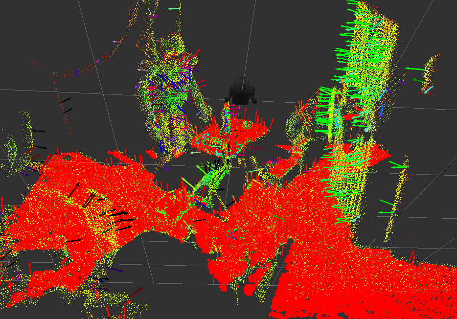

# NormalDirectionFilter


`jsk_pcl/NormalDirectionFilter` filters pointcloud based on the direction of the normal.
It can filter pointcloud based on 1) **static** direction and 2) direction based on imu linear_acceleration.

## Subscribing Topics
* `~input` (`sensor_msgs/PointCloud2`)

   input normal pointcloud.
   Point type is `pcl::Normal`.

* `~input_imu` (`sensor_msgs/Imu`)

   imu message, which is enabled if `~use_imu` parameter is true

## Publishing Topics
* `~output` (`pcl_msgs/PointIndices`)

   result of filtering as indices. You can use `pcl/ExtractIndices` to get pointcloud of the indices.

## Parameters
* `~use_imu` (Boolean, default: `False`):

   Enable `~input_imu` topic and set target direction based on imu linear acceleration.

* `~eps_angle` (Double, default: `0.2`):

   Allowed angle difference in [rad] to regard the normal as required direction.

   This parameter can be changed by `dynamic_recofigure`.

* `~angle_offset` (Double, default: `0.0`):

   Offset parameter to the angle difference.

   This parameter can be changed by `dynamic_recofigure`.

* `~direction` (Double Array, required):

   if `~use_imu` is false, the direction should be specified with this parmaeter.

* `~queue_size` (Integer, default: `200`):

   The length of input queue.

## Sample

```bash
roslaunch jsk_pcl_ros sample_normal_direction_filter.launch
```
