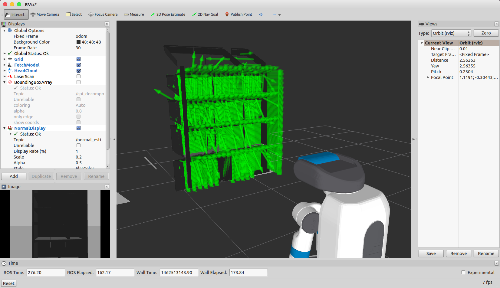

NormalEstimationIntegralImage
=============================

What is this?
-------------

Compute normals for an organized point cloud using integral images.

Subscribing Topics
------------------

- ``~input`` (``sensor_msgs/PointCloud2``)

  Input point cloud. (point type is ``pcl::PointXYZRGB``)

Publishing Topics
-----------------

- ``~output`` (``sensor_msgs/PointCloud2``)

  Output normals. (point type is ``pcl::Normal``)

- ``~output_with_xyz`` (``sensor_msgs/PointCloud2``)

  Output point cloud with normal field. (point type is ``pcl::PointXYZRGBNormal``)

Parameters
----------

- ``max_depth_change_factor`` (Double, default: 0.02)

  max depth change factor

- ``normal_smoothing_size`` (Double, default: 20.0)

  normal smoothing size parameter

- ``estimation_method`` (Int, default: 1)

  Estimation method.

  - 0: AVERAGE_3D_GRADIENT
  - 1: COVARIANCE_MATRIX
  - 2: AVERAGE_DEPTH_CHANGE

- ``depth_dependent_smoothing`` (Boolean, default: false)

  Use depth dependent smoothing.

- ``border_policy_ignore`` (Boolean, default: true)

  Ignore border policy.

Parameters above can be changed by ``dynamic_reconfigure``.

Sample
------

.. code-block:: bash

  roslaunch jsk_pcl_ros sample_normal_estimation_integral_image.launch
