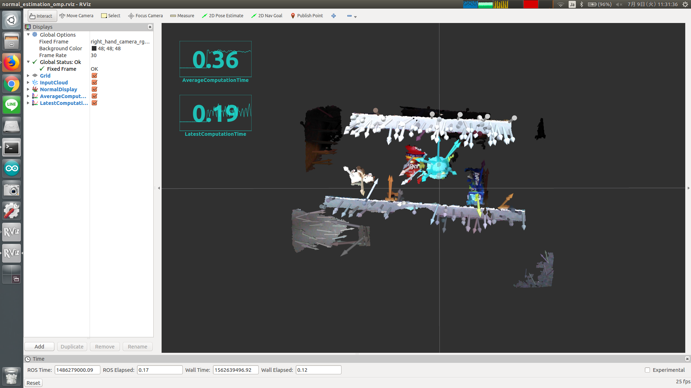

# NormalEstimationOMP



This nodelet is almost the same as `pcl/NormalEstimationOMP` of `pcl_ros` package,
but it can handle timestamp correctly.

## Subscribing Topic
* `~input` (`sensor_msgs/PointCloud2`)

  Input pointcloud. Point type is `pcl::PointXYZRGB`.

## Publishing Topic
* `~output` (`sensor_msgs/PointCloud2`)

  Output pointcloud, point type is `pcl::Normal`.

* `~output_with_xyz` (`sensor_msgs/PointCloud2`)

  Output pointcloud, point type is `pcl::PointXYZRGBNormal`.

* `~output/latest_time` (`std_msgs/Float32`)

  latest computation time

* `~output/average_time` (`std_msgs/Float32`)

  average computation time

## Parameters
* `~number_of_threads` (Int, default: `0`)

  Number of hardware threads to use.

  If `0` is specified, the number will be automatically determined.

* `~k_search` (Int, default: `10`)

  Number of k-nearest neighbors to search for.

  This parameter can be changed by `dynamic_reconfigure`.

* `~radius_search` (Float, default: `0.0`)

  Sphere radius for nearest neighbor search.

  This parameter can be changed by `dynamic_reconfigure`.

Note that either `~k_search` or `~radius_search` must be set to `0`.

## Sample

```bash
roslaunch jsk_pcl_ros sample_normal_estimation_omp.launch
```
