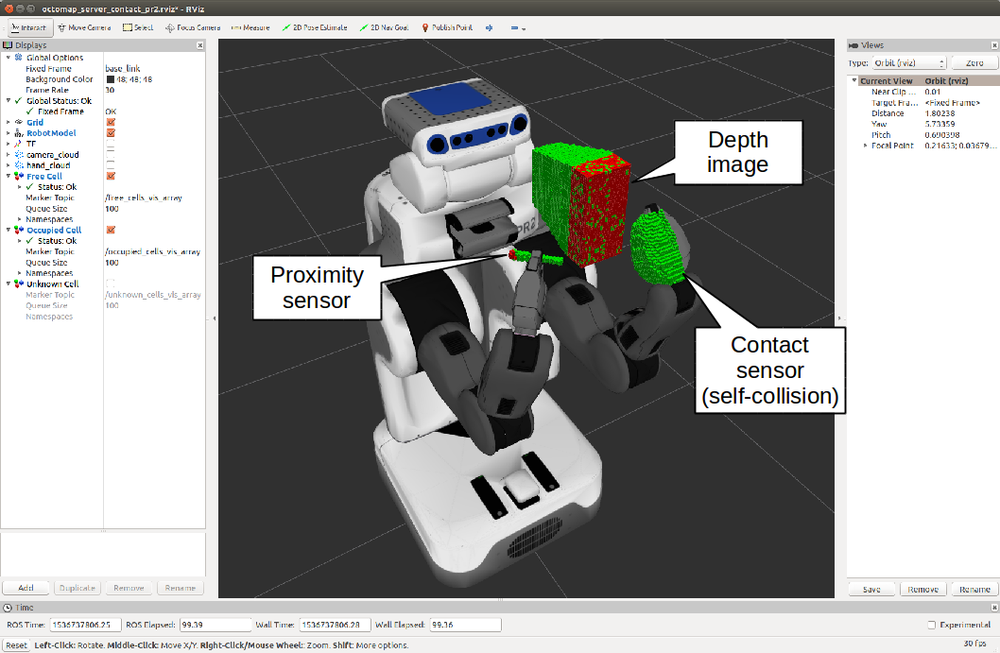

# OctomapServerContact

## What Is This
Occupancy grid map in which the contact sensor model is available.
OctomapServerContact class is derived from OctomapServer class[1].
[1] http://wiki.ros.org/octomap_server

This node has topic interface.
You can pass the output of vision and contact sensors.

## Subscribing Topics
* `contact_sensors_in` (`jsk_recognition_msgs::ContactSensorArray`):

   input contact sensor data.
* `cloud_in` (`sensor_msgs/PointCloud2`)

   input pointcloud.

* `proximity_in` (`sensor_msgs/PointCloud2`)

   input pointcloud from proximity sensors.

## Publishing Topics
* `octomap_full` (`octomap_msgs/Octomap`)

   The complete maximum-likelihood occupancy map as compact OctoMap binary stream, encoding free and occupied space. The full message contains the complete probabilities and all additional data stored in the tree. See octomap_msgs for deserializing the message. (cited from http://wiki.ros.org/octomap_server)

* `octomap_binary` (`octomap_msgs/Octomap`)
   The complete maximum-likelihood occupancy map as compact OctoMap binary stream, encoding free and occupied space. The binary message only distinguishes between free and occupied space but is smaller. See octomap_msgs for deserializing the message.The complete maximum-likelihood occupancy map as compact OctoMap binary stream, encoding free and occupied space. The binary message only distinguishes between free and occupied space but is smaller. See octomap_msgs for deserializing the message. (cited from http://wiki.ros.org/octomap_server)

* `octomap_point_cloud_centers` (`sensor_msgs/PointCloud2`)
   The centers of all occupied voxels as point cloud, useful for visualization. Note that this will have gaps as the points have no volumetric size and OctoMap voxels can have different resolutions! Use the MarkerArray topic instead. (cited from http://wiki.ros.org/octomap_server)

* `occupied_cells_vis_array` (`visualization_msgs/MarkerArray`)
   All occupied voxels as "box" markers for visualization in RViz. Be sure to subscribe to the topic occupied_cells_vis in RViz! (cited from http://wiki.ros.org/octomap_server)

* `free_cells_vis_array` (`visualization_msgs/MarkerArray`)
   All free voxels as "box" markers for visualization in RViz. Be sure to subscribe to the topic free_cells_vis in RViz!

* `unknown_cells_vis_array` (`visualization_msgs/MarkerArray`)
   All unknown voxels as "box" markers for visualization in RViz. Be sure to subscribe to the topic unknown_cells_vis in RViz!

* `octomap_unknown_point_cloud_centers` (`sensor_msgs/PointCloud2`)
   The centers of all unknown voxels as point cloud, useful for visualization. Note that this will have gaps as the points have no volumetric size, but all unknown voxels are divided into resolution size.

* `frontier_cells_vis_array` (`visualization_msgs/MarkerArray`)
   All frontier voxels as "box" markers for visualization in RViz. Be sure to subscribe to the topic frontier_cells_vis in RViz!

* `octomap_frontier_point_cloud_centers` (`sensor_msgs/PointCloud2`)
   The centers of all frontier voxels as point cloud, useful for visualization. Note that this will have gaps as the points have no volumetric size, but all frontier voxels are divided into resolution size.

* `projected_map` (`nav_msgs/OccupancyGrid`)
   Downprojected 2D occupancy map from the 3D map. Be sure to remap this topic if you have another 2D map server running. New / changed in octomap_mapping 0.4.4: The topic is now projected_map by default to avoid collisions with static 2D maps (cited from http://wiki.ros.org/octomap_server)

## Advertising Services
* `octomap_binary` (`octomap_msgs/GetOctomap`)

    Same with original OctomapServer.
    The complete maximum-likelihood occupancy map as compact OctoMap binary stream, encoding free and occupied space.

* `~clear_bbx` (`octomap_msgs/BoundingBoxQuery`)

    Same with original OctomapServer.
    Clears a region in the 3D occupancy map, setting all voxels in the region to "free"

* `~reset` (`std_srvs/Empty`)

    Same with original OctomapServer.
    Resets the complete map

## Parameters
* `~self_see_default_padding` (Double, default: `0.001`)

  Same as the parameter in pr2_navigation_self_filter.
  Padding of contact sensor link.
* `~self_see_default_scale` (Double, default: `1.0`)

  Same as the parameter in pr2_navigation_self_filter.
  Scale of contact sensor link.
* `~self_see_links` (Array of link configuration, required)

  Same as the parameter in pr2_navigation_self_filter.
  Configuration of links for contact sensor.
  Link configuratin consists of name (required), padding (optional), and scale (optional).

* `~frame_id` (String, default: `/map`)

    Same with original OctomapServer.
    Static global frame in which the map will be published. A transform from sensor data to this frame needs to be available when dynamically building maps.
* `~resolution` (float, default: `0.05`)

    Same with original OctomapServer.
    Resolution in meter for the map when starting with an empty map. Otherwise the loaded file's resolution is used.

* `~base_frame_id` (string, default: `base_footprint`)

    Same with original OctomapServer.
    The robot's base frame in which ground plane detection is performed` (if enabled)
* `~height_map` (bool, default: `true`)

    Same with original OctomapServer.
    Whether visualization should encode height with different colors
* `~color/[r/g/b/a]` (float)

    Same with original OctomapServer.
    Color for visualizing occupied cells when ~heigh_map=False, in range [0:1]
* `~color_free/[r/g/b/a]` (float)

    Color for visualizing free cells
* `~color_unknown/[r/g/b/a]` (float)

    Color for visualizing unknown cells.
* `~color_frontier/[r/g/b/a]` (float)

     Color for visualizing frontier cells.
* `~sensor_model/max_range` (float, default: `-1 (unlimited)`)

    Same with original OctomapServer.
    Maximum range in meter for inserting point cloud data when dynamically building a map. Limiting the range to something useful (e.g. 5m) prevents spurious erroneous points far away from the robot.
* `~sensor_model/[hit|miss]` (float, default: `0.7 / 0.4`)

    Same with original OctomapServer.
    Probabilities for hits and misses in the sensor model when dynamically building a map
* `~sensor_model/[min|max]` (float, default: `0.12 / 0.97`)

    Same with original OctomapServer.
    Minimum and maximum probability for clamping when dynamically building a map
* `~latch` (bool, default: `True for a static map, false if no initial map is given`)

    Same with original OctomapServer.
    Whether topics are published latched or only once per change. For maximum performance when building a map (with frequent updates), set to false. When set to true, on every map change all topics and visualizations will be created.
* `~filter_ground` (bool, default: `false`)

    Same with original OctomapServer.
    Whether the ground plane should be detected and ignored from scan data when dynamically building a map, using pcl::SACMODEL_PERPENDICULAR_PLANE. This clears everything up to the ground, but will not insert the ground as obstacle in the map. If this is enabled, it can be further configured with the ~ground_filter/... parameters.
* `~ground_filter/distance` (float, default: `0.04`)

    Same with original OctomapServer.
    Distance threshold for points (in z direction) to be segmented to the ground plane
* `~ground_filter/angle` (float, default: `0.15`)

    Same with original OctomapServer.
    Angular threshold of the detected plane from the horizontal plane to be detected as ground
* `~ground_filter/plane_distance` (float, default: `0.07`)

    Same with original OctomapServer.
    Distance threshold from z=0 for a plane to be detected as ground (4th coefficient of the plane equation from PCL)
* `~pointcloud_[min|max]_[x|y|z]` (float, default: `-/+ infinity`)

    Minimum and maximum height of points to consider for insertion in the callback. Any point outside of this intervall will be discarded before running any insertion or ground plane filtering. You can do a rough filtering based on height with this, but if you enable the ground_filter this interval needs to include the ground plane.
* `~occupancy_[min|max]_[x|y|z]` (float, default: `-/+ infinity`)

    Minimum and maximum height of occupied cells to be consider in the final map. This ignores all occupied voxels outside of the interval when sending out visualizations and collision maps, but will not affect the actual octomap representation.

## Sample
### Simulation
``
roslaunch jsk_pcl_ros sample_octomap_server_contact_pr2.launch
``

### Real
Plug the depth sensor which can be launched by openni.launch and run the below command.

``
roslaunch jsk_pcl_ros octomap_server_contact.launch
``

If you want to see how frontier grids works, run the below command.

``
roslaunch jsk_pcl_ros sample_octomap_contact.launch
``
