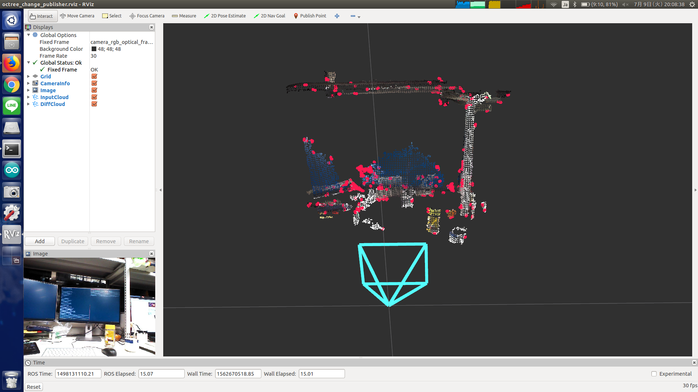

# OctreeChangePublisher



## What Is This

This nodelet will publish the difference of sequential pointcloud.
You can get the newly generated pointclouds.

Difference with `pcl_ros/SegmentDifference` refer
[https://github.com/jsk-ros-pkg/jsk_recognition/pull/67](https://github.com/jsk-ros-pkg/jsk_recognition/pull/67)


## Subscribing Topic

* `~input` (`sensor_msgs/PointCloud2`)

  Input point cloud.


## Publishing Topic

* `~octree_change_result` (`sensor_msgs/PointCloud2`)

  Point cloud which did not exist in previous time.


## Parameters

* `~resolution` (Float, default: `0.02`)

  Octree resolution at lowest octree level in meters.

* `~noise_filter` (Int, default: `2`)

  Minimum amount of points required within leaf node to become serialized.

These parameters can be changed by `dynamic_reconfigure`.


## Sample

```bash
roslaunch jsk_pcl_ros sample_octree_change_publisher.launch
```
