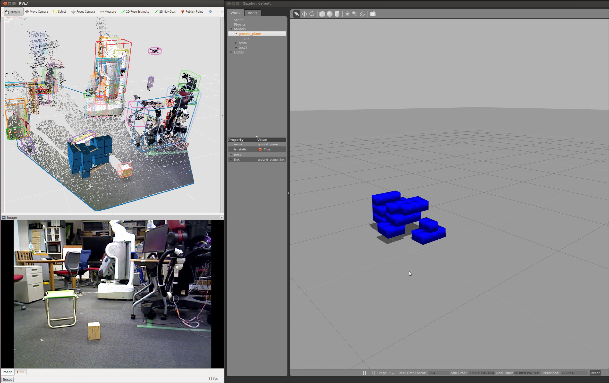

# OctreeVoxelGrid


## What Is This
This is a nodelet to get voxel grided cloud from point cloud.
`VoxelGrid`[1] and `ApproximateVoxelGrid` also generate voxel filtered cloud,
but those clouds are not aligned.

i.e. This nodelet outputs the center position of each aligned voxel grid,
and other voxel filtered functions output the other position such as the centroid of belonging points.

[1] http://pointclouds.org/documentation/tutorials/voxel_grid.php

## Subscribing Topics
* `~input` (`sensor_msgs/PointCloud2`):

   input pointcloud.

## Publishing Topics
* `~output` (`sensor_msgs/PointCloud2`):

   Voxel grided clouds.
* `~output_marker` (`visualization_msgs/Marker`):

   Voxel grided clouds.

## Parameters
* `~publish_marker` (Boolean, default: `true`):

   Publish voxel grided clouds as `visualization_msgs/Marker` topic.

## Dynamic Reconfigure Parameters
* `~resolution` (Double, default: `0.1`):

   Resolution of voxel grid.

## Sample
Plug the depth sensor which can be launched by openni.launch and run the below command.
Voxel grided clouds are published with topics `/octree_voxel_grid/octgrid/output` and `/octree_voxel_grid/octgrid/output_marker`.


```
roslaunch jsk_pcl_ros octree_voxel_grid.launch
```

## Application
### URDF model generation


Launch a server of `jsk_pcl_ros/VoxelModelGenerate` typed service.
This node is launched in octree_voxel_grid.launch by default.
In the service callback, a urdf model is generated from `visualization_msgs/Marker` typed data.
```
rosrun jsk_pcl_ros scripts/voxel_urdf_generator.py
```

Request a `jsk_pcl_ros/VoxelModelGenerate` typed service from Marker topic, which represents voxels.
`~publish_marker` should be `True`.
Urdf model file `/tmp/test.urdf` is generated.
```
rosrun jsk_pcl_ros voxel_urdf_client.py input:=/octree_voxel_grid/octgrid/output_marker
```

### Voxel model insertion into gazebo


Plug the openni depth sensor such as xtion.

Launch openni and get point cloud.
```
roslaunch openni_launch openni.launch depth_registration:=true
```
Launch gazebo.
```
rosrun gazebo_ros gazebo
```
Launch the segmentation program to get point cloud belonging to one object.
```
roslaunch jsk_pcl_ros organized_multi_plane_segmentation.launch INPUT:=/camera/depth_registered/points
```
Launch the octree filter program to get voxel-grided cloud.
```
roslaunch jsk_pcl_ros octree_voxel_grid.launch INPUT:=/selected_pointcloud
```
Launch node to request model geneartion and insert the generated model into gazebo.
```
rosrun jsk_pcl_ros voxel_urdf_client.py input:=/octree_voxel_grid/octgrid/output_marker --gazebo true
```
Launch rviz. Select the segmentated point cloud by clicking bounding box.
The selected point cloud is published as `selected_pointcloud` and passed to OctreeVoxelGrid.
```
rosrun rviz rviz
```


