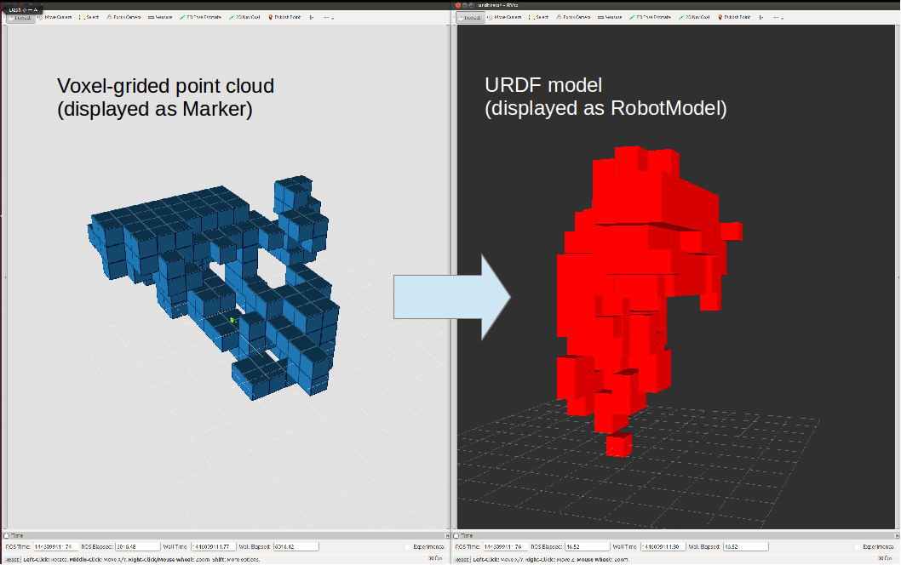

# OctreeVoxelGrid


## What Is This
This is a nodelet to get voxel grided cloud from point cloud.
`VoxelGrid`[1] and `ApproximateVoxelGrid` also generate voxel filtered cloud,
but those clouds are not aligned.

i.e. This nodelet outputs the center position of each aligned voxel grid,
and other voxel filtered functions output the other position such as the centroid of belonging points.

[1] http://pointclouds.org/documentation/tutorials/voxel_grid.php

## Subscribing Topics
* `~input` (`sensor_msgs/PointCloud2`):

   input pointcloud.

## Publishing Topics
* `~output` (`sensor_msgs/PointCloud2`):

   Voxel grided clouds.
* `~output_marker` (`visualization_msgs/Marker`):

   Voxel grided clouds.

## Parameters
* `~publish_marker` (Boolean, default: `true`):

   Publish voxel grided clouds as `visualization_msgs/Marker` topic.

## Dynamic Reconfigure Parameters
* `~octree_resolution` (Double, default: `0.1`):

   Octree resolution passed to `OctreePointCloudCompression`.

   See http://docs.pointclouds.org/trunk/classpcl_1_1io_1_1_octree_point_cloud_compression.html.
* `~point_resolution` (Double, default: `0.1`):

   Point resolution passed to `OctreePointCloudCompression`.

   See http://docs.pointclouds.org/trunk/classpcl_1_1io_1_1_octree_point_cloud_compression.html.
* `~show_statistics` (Boolean, default: `false`):

   Show statistics in `OctreePointCloudCompression`.

   See http://docs.pointclouds.org/trunk/classpcl_1_1io_1_1_octree_point_cloud_compression.html.  

## Sample
Plug the depth sensor which can be launched by openni.launch and run the below command.
Voxel grided clouds are published with topics `/octree_voxel_grid/octgrid/output` and `/octree_voxel_grid/octgrid/output_marker`.


```
roslaunch jsk_pcl_ros octree_voxel_grid.launch
```

## Application
* URDF model generation


Launch a server of `jsk_pcl_ros/VoxelModelGenerate` typed service.
In the service callback, a urdf model is generated from `visualization_msgs/Marker` typed data.
```
rosrun jsk_pcl_ros scripts/voxel_urdf_generator.py
```

Request a `jsk_pcl_ros/VoxelModelGenerate` typed service from Marker topic, which represents voxels.
`~publish_marker` should be `True`.
```
rosrun jsk_pcl_ros voxel_urdf_client.py input:=/octree_voxel_grid/octgrid/output_marker
```
