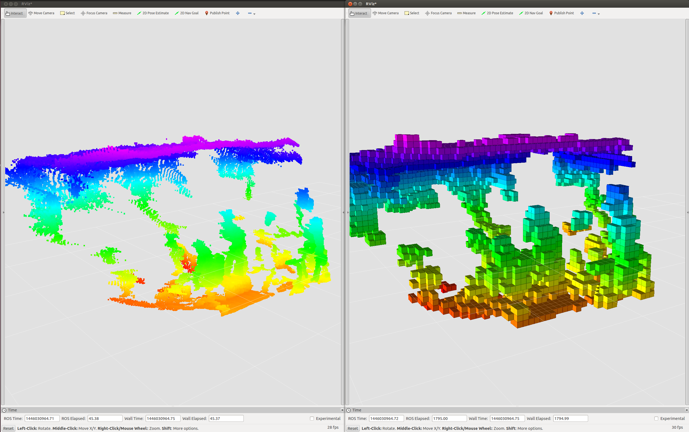

# OctreeVoxelGrid


## What Is This
This is a nodelet to get voxel grided cloud from point cloud.
`VoxelGrid`[1] and `ApproximateVoxelGrid` also generate voxel filtered cloud,
but those clouds are not aligned.

i.e. This nodelet outputs the center position of each aligned voxel grid,
and other voxel filtered functions output the other position such as the centroid of belonging points.

[1] http://pointclouds.org/documentation/tutorials/voxel_grid.php

## Subscribing Topics
* `~input` (`sensor_msgs/PointCloud2`):

   input pointcloud.

## Publishing Topics
* `~output` (`sensor_msgs/PointCloud2`):

   Voxel grided clouds.

* `~output_marker` (`visualization_msgs/Marker`):
* `~output_marker_array` (`visualization_msgs/MarkerArray`):

   Voxel grided clouds.

* `~output_resolution` (`std_msgs/Float32`)

   Resolution of octree.

## Parameters
* `~publish_marker` (Boolean, default: `true`):

   Publish voxel grided clouds as `visualization_msgs/Marker` topic.

## Dynamic Reconfigure Parameters
* `~resolution` (Double, default: `0.1`):

   Resolution of voxel grid. If resolution is set as 0, it just relays input pointcloud.
* `~marker_color` (String, default: `z`)

  Method to decide color of marker. z, x, y or flat can be selected.

* `~marker_color_alpha` (Double, default: `0.8`)

  Alpha value of marker color.

## Sample
Plug the depth sensor which can be launched by openni.launch and run the below command.
Voxel grided clouds are published with topics `/octree_voxel_grid/octgrid/output` and `/octree_voxel_grid/octgrid/output_marker`.


```
roslaunch jsk_pcl_ros octree_voxel_grid.launch
```
