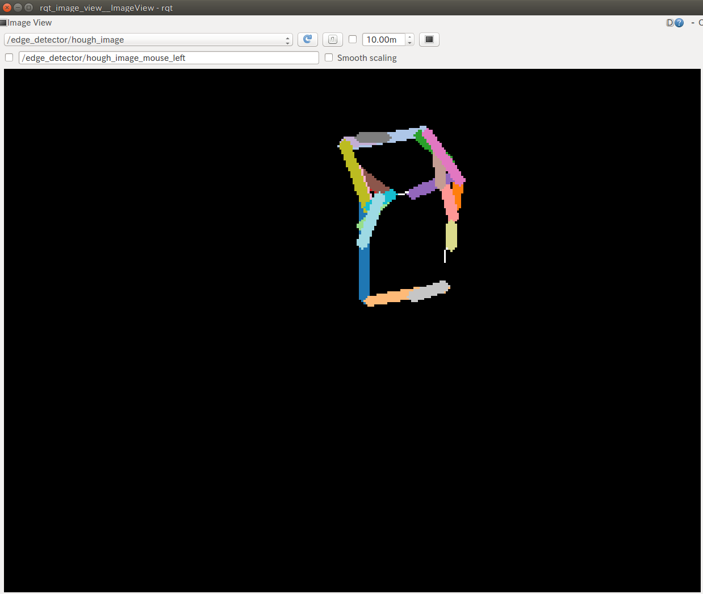

OrganizedEdgeDetector
=====================

What is this?
-------------

.. image:: images/organized_edge_detector.png

Detect edges from organized point cloud.

.. note:: This node requires PCL > 1.7.2.

Subscribing Topics
------------------

- ``~input`` (``sensor_msgs/PointCloud2``)

  Input point cloud.

Publishing Topics
-----------------

- ``~output_nan_boundary_edge_indices``
- ``~output_occluding_edge_indices``
- ``~output_occluded_edge_indices``
- ``~output_curvature_edge_indices``
- ``~output_rgb_edge_indices``
- ``~output_indices``

  Output point indices.

- ``~output_normal``
- ``~output_nan_boundary_edge``
- ``~output_occluding_edge``
- ``~output_occluded_edge``
- ``~output_curvature_edge``
- ``~output_rgb_edge``
- ``~output``

  Output point cloud.

- ``~edge_image``
- ``~hough_image``

  Debug image.
  Visualize the input and output image of ``cv::HoughLinesP``.

Parameters
----------

- ``max_depth_change_factor``, (``Double``, default: ``0.02``)

  Max depth change factor.

- ``normal_smoothing_size``, (``Double``, default: ``20.0``)

  Normal smoothing size parameter.

- ``estimation_method``, (``Int``, default: ``0``)

  Estimation method.

- ``depth_dependent_smoothing`` (Boolean, default: ``false``)

  Use depth dependent smoothing.

- ``border_policy_ignore`` (Boolean, default: ``true``)

  Ignore border policy.

- ``max_search_neighbors`` (Int, default: ``100``)

  The maximum number of the neighbors used in edge detection.

- ``depth_discontinuation_threshold`` (Double, default: ``0.04``)

  Threshold about depth discontinuation used in edge detection.

- ``publish_normal`` (Boolean, default: ``false``)

  Publish normal pointcloud

- ``use_nan_boundary`` (Boolean, default: ``false``)

  Detect NAN Boundary Edge
- ``use_occluding`` (Boolean, ``true``)

  Detect Occluding Edge
- ``use_occluded`` (Boolean, ``true``)

  Detect Occluded Edge
- ``use_curvature`` (Boolean, ``true``)

  Detect Curvature Edge
- ``use_rgb`` (Boolean, ``false``)

  Detect RGB Edge
- ``use_straightline_detection`` (Boolean, ``true``)

  Detect Straight Lines
- ``rho`` (Double, 1, 50)

  rho Used in Straight Lines Detection(in pixel)
- ``theta`` (Double,  Default: ``1``)

  The resolution of the parameter \theta in radians. We use 1 degree (CV_PI/180) Used in Straight Lines Detection.

- ``straightline_threshold`` (Int, default: 50)

  The minimum number of intersections to 'detect' a line, Used in Straight Lines Detection

- ``min_line_length`` (Double, default: 50)

  The minimum number of points that can form a line. Lines with less than this number of points are disregarded. Used in Straight Lines Detection.

- ``max_line_gap`` (Double, default: 10)

  The maximum gap between two points to be considered in the same line. Used in Straight Lines Detection.

- ``publish_debug_image``, (Boolean, default: true)

  Publish Debug Images.
