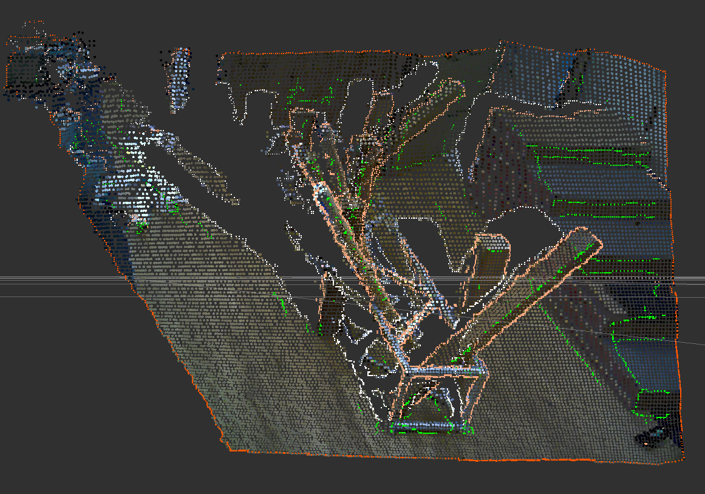

OrganizedEdgeDetector
=====================

What is this?
-------------

Detect edges from organized point cloud.

.. note:: This node requires PCL > 1.7.2.

Subscribing Topics
------------------

- ``~input`` (``sensor_msgs/PointCloud2``)

  Input organized point cloud.

Publishing Topics
-----------------

- ``~output_normal`` (``sensor_msgs/PointCloud2``)

  Estimated normal of whole point cloud.

  Point type is ``pcl::Normal``.

  This topic is published only when ``~publish_normal`` is ``true``.

- ``~output_nan_boundary_edge_indices`` (``pcl_msgs/PointIndices``)
- ``~output_occluding_edge_indices`` (``pcl_msgs/PointIndices``)
- ``~output_occluded_edge_indices`` (``pcl_msgs/PointIndices``)
- ``~output_curvature_edge_indices`` (``pcl_msgs/PointIndices``)
- ``~output_rgb_edge_indices`` (``pcl_msgs/PointIndices``)
- ``~output_indices`` (``pcl_msgs/PointIndices``)

  Output edge indices.

  ``~output_indices`` means all of the edge indices above.

- ``~output_nan_boundary_edge`` (``sensor_msgs/PointCloud2``)
- ``~output_occluding_edge`` (``sensor_msgs/PointCloud2``)
- ``~output_occluded_edge`` (``sensor_msgs/PointCloud2``)
- ``~output_curvature_edge`` (``sensor_msgs/PointCloud2``)
- ``~output_rgb_edge`` (``sensor_msgs/PointCloud2``)
- ``~output`` (``sensor_msgs/PointCloud2``)

  Output point cloud of edge.

  ``~output`` means all of the edge point cloud above.

- ``~output_straight_edges_indices`` (``jsk_recognition_msgs/ClusterPointIndices``)

  Cluster indices containing straight edges.

  This topic is published only when ``~use_straightline_detection`` is ``true``.

- ``~edge_image`` (``sensor_msgs/Image``)
- ``~hough_image`` (``sensor_msgs/Image``)

  Debug image.
  Visualize the input and output image of ``cv::HoughLinesP``.

  These topics are published only when ``~use_straightline_detection`` is ``true``
  and ``~publish_debug_image`` is ``true``.

  .. image:: images/organized_edge_detector_hough_image.png

Parameters
----------

Parameters for estimating normal
^^^^^^^^^^^^^^^^^^^^^^^^^^^^^^^^

- ``~publish_normal`` (Boolean, default: ``false``)

  Publish normal pointcloud or not.

- ``~max_depth_change_factor``, (Double, default: ``0.02``)

  Max depth change factor.

- ``~normal_smoothing_size``, (Double, default: ``20.0``)

  Normal smoothing size parameter.

- ``~estimation_method``, (Int, default: ``1``)

  Estimation method.

  Choose from ``AVERAGE_3D_GRADIENT(1)``, ``COVARIANCE_MATRIX(1)`` and
  ``AVERAGE_DEPTH_CHANGE(2)``.

- ``~depth_dependent_smoothing`` (Boolean, default: ``false``)

  Use depth dependent smoothing.

- ``~border_policy_ignore`` (Boolean, default: ``true``)

  Ignore border policy.

Parameters for estimating edge
^^^^^^^^^^^^^^^^^^^^^^^^^^^^^^

- ``~max_search_neighbors`` (Int, default: ``100``)

  The maximum search distance for deciding occluding and occluded edges

- ``~depth_discontinuation_threshold`` (Double, default: ``0.04``)

  Threshold about depth discontinuation between neighboring points in meters.

- ``~use_nan_boundary`` (Boolean, default: ``false``)

  Add NAN Boundary Edge to estimating edge type

- ``~use_occluding`` (Boolean, default: ``true``)

  Add Occluding Edge to estimating edge type

- ``~use_occluded`` (Boolean, default: ``true``)

  Add Occluded Edge to estimating edge type

- ``~use_curvature`` (Boolean, default: ``true``)

  Add High Curvature Edge to estimating edge type

- ``~use_rgb`` (Boolean, default: ``false``)

  Add RGB Canny Edge to estimating edge type

Parameters for estimating straight edge
^^^^^^^^^^^^^^^^^^^^^^^^^^^^^^^^^^^^^^^

- ``~use_straightline_detection`` (Boolean, default: ``true``)

  Estimate Straight Lines or not.

- ``~rho`` (Double, default: ``1``)

  Distance resolution of the accumulator in pixels.

- ``~theta`` (Double,  Default: ``1``)

  Angle resolution of the accumulator in degrees.

- ``~straightline_threshold`` (Int, default: ``50``)

  The minimum number of intersections to 'detect' a line.

- ``~min_line_length`` (Double, default: ``50``)

  The minimum number of points that can form a line.

  Lines with less than this number of points are disregarded.

- ``~max_line_gap`` (Double, default: ``10``)

  The maximum gap between two points to be considered in the same line.

- ``~publish_debug_image`` (Boolean, default: ``true``)

  Publish Debug Images.

Sample
------

.. code-block:: bash

  roslaunch jsk_pcl_ros sample_organized_edge_detector.launch
