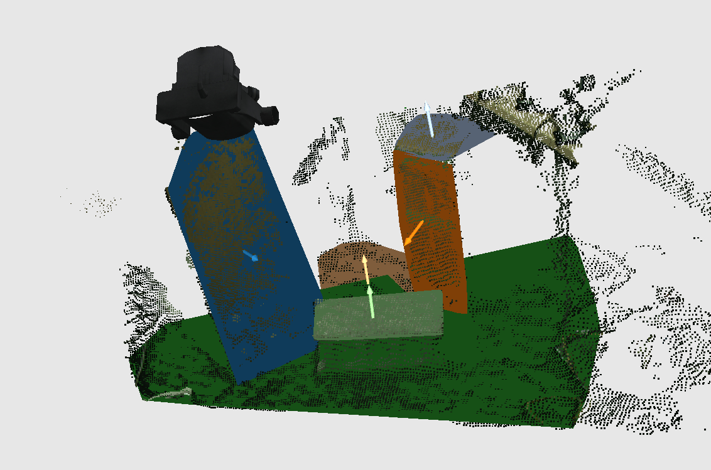
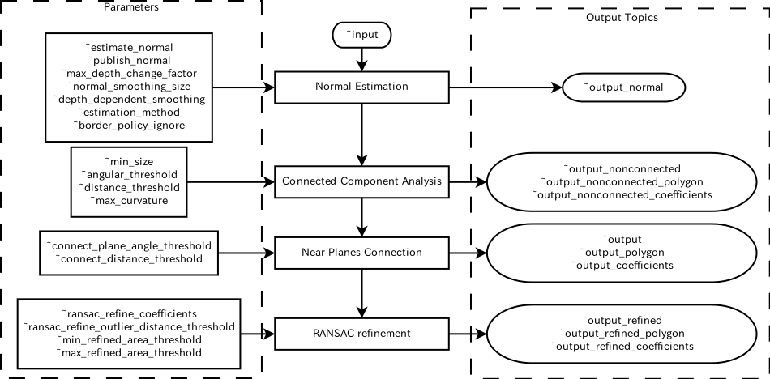

# OrganizedMultiPlaneSegmentation
## What Is This


This nodelet segments multiple planes from **organized** pointcloud.
It estimates planes based on [connected-component analysis](http://en.wikipedia.org/wiki/Connected-component_labeling)
using `pcl::OrganizedMultiPlaneSegmentation`.

 shows the overview of the pipeline.

1. Estimate normal using integral image.
2. Conduct connected component analysis to estimate planar regions.
3. Connect neighbor planes if the normal directions and the borders of the planes are near enough.
4. Refine plane coefficients of connected planes based on RANSAC. If the areas of the planes after refinement are too small, they will be removed.

These process is implemented in one nodelet in order not to convert pointcloud between
PCL and ROS.

## Subscribing Topics
* `~input` (`sensor_msgs/PointCloud2`):

   Input pointcloud. This should be **organized** pointcloud.

## Publishing Topics
* `~output` (`jsk_recognition_msgs/ClusterPointIndices`):
* `~output_polygon` (`jsk_recognition_msgs/PolygonArray`):
* `~output_coefficients` (`jsk_recognition_msgs/ModelCoefficientsArray`)

   The inliers, coefficients and convex polygons of the connected polygons.
* `~output_nonconnected` (`jsk_recognition_msgs/ClusterPointIndices`):
* `~output_nonconnected_polygon` (`jsk_recognition_msgs/PolygonArray`):
* `~output_nonconnected_coefficients` (`jsk_recognition_msgs/ModelCoefficientsArray`)

   The inliers, coefficients and polygons of the polygons of connected components analysis.
* `~output_refined` (`jsk_recognition_msgs/ClusterPointIndices`):
* `~output_refined_polygon` (`jsk_recognition_msgs/PolygonArray`):
* `~output_refined_coefficients` (`jsk_recognition_msgs/ModelCoefficientsArray`)

   The inliers, coefficients and convex polygons of the refined polygons.
* `~output_normal` (`sensor_msgs/PointCloud2`):

   The pointcloud of normal of `~input` pointcloud.

   Point type is `pcl::Normal`.

## Parameters
* `~estimate_normal` (Boolean, default: `True`):

   Estimate normal if it is set to `True`
* `~publish_normal` (Boolean, default: `False`):

   Publish the result of normal to `~output_normal`
* `~max_depth_change_factor` (Double, default: `0.02`):

   The depth change threshold for computing object borders in normal estimation.
* `~normal_smoothing_size` (Double, default: `20.0`):

   the size of the area used to smooth normals
   (depth dependent if `~depth_dependent_smoothing` is true)
* `~depth_dependent_smoothing` (Boolean, default: `False`)

   Smooth normal depending on depth
* `~estimation_method` (Integer, default: `1`)

   Estimation method of normal. You can choose one of `AVERAGE_3D_GRADIENT(0)`, `COVARIANCE_MATRIX(1)` and `AVERAGE_DEPTH_CHANGE(2)`.
* `~border_policy_ignore` (Boolean, default: `True`)

   Ignore border if this is `True`
* `~min_size` (Integer, default: `2000`)

   Minimum number of the points on a planar region during connected component analysis.
   We recommend smaller size for this parameter in order to get stable result.
* `~angular_threshold` (Double, default: `0.05`)
* `~distance_threshold` (Double, default: `0.01`)

   Distance and angular threshold in connected component analysis.
* `~max_curvature` (Double, default: `0.001`)

   The maximum curvature allowed for a planar region
* `~connect_plane_angle_threshold` (Double, default: `0.2`)
* `~connect_distance_threshold` (Double, default: `0.01`)

   These parameters affect near plane connection. OrganizedMultiPlaneSegmentation connects
   planes which have near normal direction and whose boundaries are near enough.
* `~ransac_refine_coefficients` (Boolean, default: `True`)

   Conduct RANSAC refinment for each plane if it is true.
* `~ransac_refine_outlier_distance_threshold` (Double, default: `0.1`)

   Outlier threshold of RANSAC refinment for each plane.
* `~min_refined_area_threshold` (Double, default: `0.04`)
* `~max_refined_area_threshold` (Double, default: `10000`)

   Minimum and maximum area threshold for each convex polygon.

## Sample

```bash
roslaunch jsk_pcl_ros sample_organized_multi_plane_segmentation.launch
```
