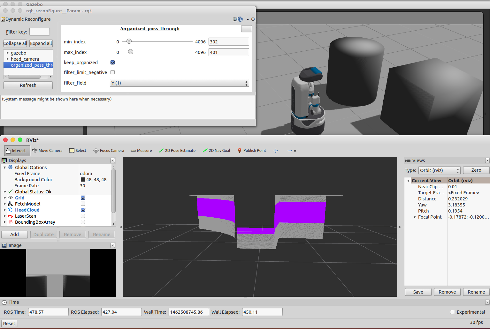

OrganizedPassThrough
====================

What Is This?
-------------

Filter organized pointcloud based on specified index range.

Subscribing Topic
-----------------

-  ``~input`` (``sensor_msgs/PointCloud2``)

  Organized point cloud.

Publishing Topic
----------------

-  ``~output`` (``sensor_msgs/PointCloud2``)

  Filtered point cloud.

Parameter
---------

- ``~min_index`` (``Int``, default: ``0``)

  Minimum index along ``~filter_field`` axis that are included.

- ``~max_index`` (``Int``, default: ``640``)

  Maximum index along ``~filter_field`` axis that are included.

- ``~keep_organized`` (``Boolean``, default: ``true``)

  Set keep_organized when extract indices.

- ``~remove_nan`` (``Boolean``, default: ``false``)

  Remove points with x, y, or z equal to NaN.

- ``~filter_limit_negative`` (``Boolean``, default: ``false``)

  Set negative when convert indices to point cloud.

- ``~filter_field`` (``Int``, default: ``0``)

  - ``0``: Filter based on x field.
  - ``1``: Filter based on y field.

These parameters can be changed by ``dynamic_reconfigure``.

Sample
------

.. code-block:: bash

  roslaunch jsk_pcl_ros sample_organized_pass_through.launch
