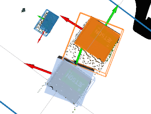

# OrganizedStatisticalOutlierRemoval


Organized version of statistical outlier removal.

## Subscribing Topic

* `~input` (`sensor_msgs/PointCloud2`)

  Input pointcloud to be removed outlier.

* `~input/cluster_indices` (`jsk_recognition_msgs/ClusterPointIndices`)

  Input cluster point indices to be removed outlier.
  The clusters are used to calculate deviations.
  This topic is only subscribe when `~use_cluster_point_indices` is `True`.

### Example with `ClusterPointIndices`


## Publishing Topic

* `~output` (`sensor_msgs/PointCloud2`)

  Output pointcloud.

## Parameter
* `~use_cluster_point_indices` (Boolean, default: `False`)

  use cluster point indices or not.
  this option is designed to use after clustering (i.e. euclidean clustering),
  because we can consider the distribution of each cluster with cluster point indices
  information.

* `~keep_organized` (Boolean, default: `True`)

  keep organized point cloud or not

* `~negative` (Boolean, default: `False`)

  remove outlier or remove other than outlier.


* `~mean_k` (Int, default: `2`)

  mean k value for statistical outlier removal.

* `~stddev` (Double, default: `0.0`)

  std deviation multipelier for statistical outlier removal.

* `~approximate_sync` (Boolean, default: `False`)

  use approximate sync or not.
  this option is valid when `~use_cluster_point_indices` is `True`.

* `~queue_size` (Int, default: `100`)

  queue size for message filter.
  this option is valid when `~use_cluster_point_indices` is `True`.

## Sample

### Normal version

```
roslaunch jsk_pcl_ros sample_organized_statistical_outlier_removal.launch
```

### ClusterPointIndices version

```
roslaunch jsk_pcl_ros sample_realsense_tabletop_object_detector.launch
```
