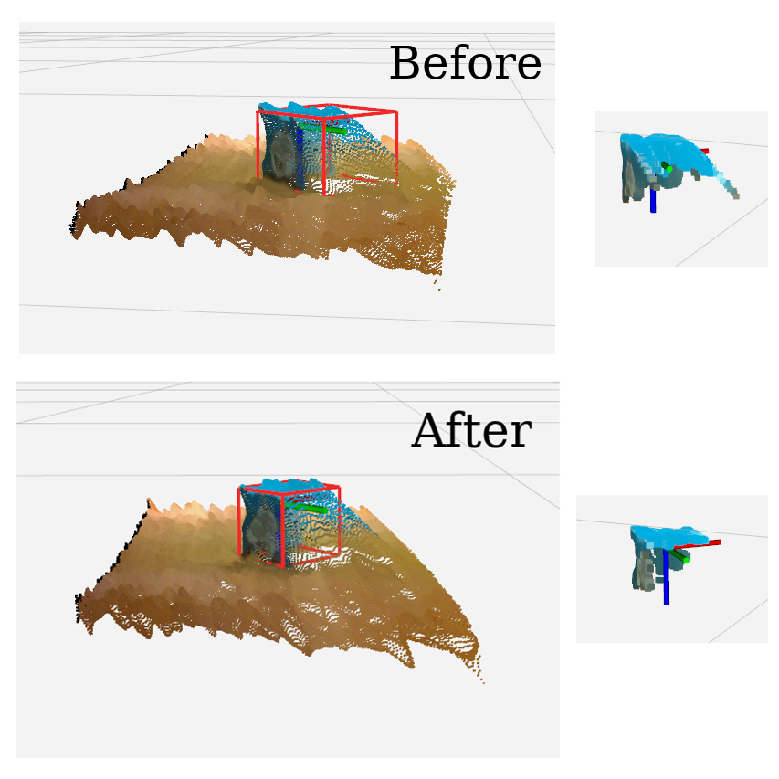

# OrganizedStatisticalOutlierRemoval 


Organized version of statistical outlier removal.

## Subscribing Topic

* `~input` (`sensor_msgs/PointCloud2`)

  Input pointcloud to be removed outlier.

## Publishing Topic

* `~output` (`sensor_msgs/PointCloud2`)

  Output pointcloud.

## Parameter
* `~keep_organized` (Boolean, default: `True`)

  keep organized point cloud or not

* `~negative` (Boolean, default: `False`)

  remove outlier or remove other than outlier.


* `~mean_k` (Int, default: `2`)

  mean k value for statistical outlier removal.

* `~stddev` (Double, default: `0.0`)

  std deviation multipelier for statistical outlier removal.

## Sample

```
roslaunch jsk_pcl_ros organized_statistical_outlier_removal.launch
```
