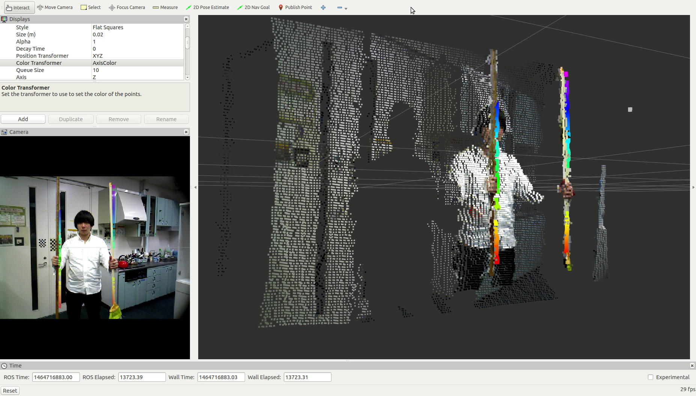

ParallelEdgeFinder
==================

What is this?
-------------

Find parallel edges from multiple lines.

Subscribing Topics
------------------

- ``~input_indices`` (``jsk_recognition_msgs/ClusterPointIndices``)

  Cluster point indices of multiple lines.

- ``~input_coefficients`` (``jsk_recognition_msgs/ModelCoefficientsArray``)

  coefficients of lines for each cluster.

Publishing Topics
-----------------

- ``~output_edges_groups`` (``jsk_recognition_msgs/ParallelEdgeArray``)

  Array of parallel edge pairs.

- ``~output_clusters`` (``jsk_recognition_msgs/ClusterPointIndices``)

  Parallel edge clusters extracted from ``~input_indices``.

Parameters
----------

- ``~angular_threshold`` (``Double``, default: ``0.1``)

  Allowable angle of inclination of pair of edges in radians.

Sample
------

.. code-block:: bash

  roslaunch jsk_pcl_ros sample_parallel_edge_finder.launch
