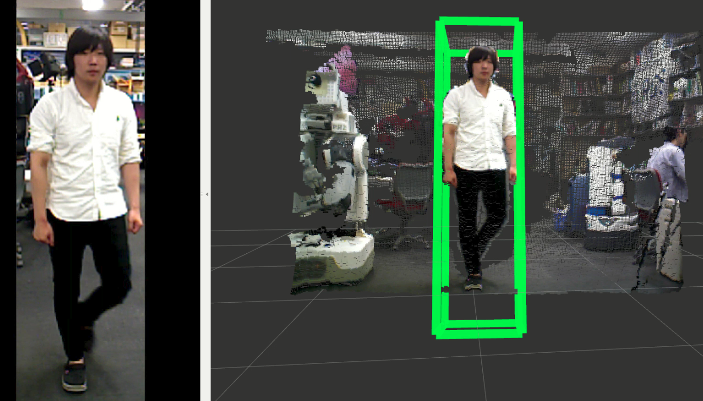

PeopleDetection
===============

What is this?
-------------

Detecting people on a ground plane with RGB-D data.

Subscribing Topics
------------------

- ``~input`` (``sensor_msgs/PointCloud2``)

- ``~input/info`` (``sensor_msgs/CameraInfo``)

- ``~input/coefficients`` (``jsk_recognition_msgs/ModelCoefficientsArray``)

  Gound plane's coefficients.

Publishing Topics
-----------------

- ``~boxes`` (``jsk_recognition_msgs/BoundingBoxArray``)

  Bounding Box of detected people.

Parameters
----------

- ``~filename`` (``String``, default: ``""``)

  traind SVM filename.

- ``~people_height_threshold`` (``Double``, default: ``0.5``)

- ``~min_confidence`` (``Double``, default: ``-1.5``)

- ``~queue_size`` (``Int``, default: ``1``)

- ``~voxel_size`` (``Double``, default: ``0.03``)

- ``~box_width`` (``Double``, default: ``0.5``)

- ``~box_depth`` (``Double``, default: ``0.5``)

Sample
------

.. code-block:: bash

  roslaunch jsk_pcl_ros sample_people_detection.launch
