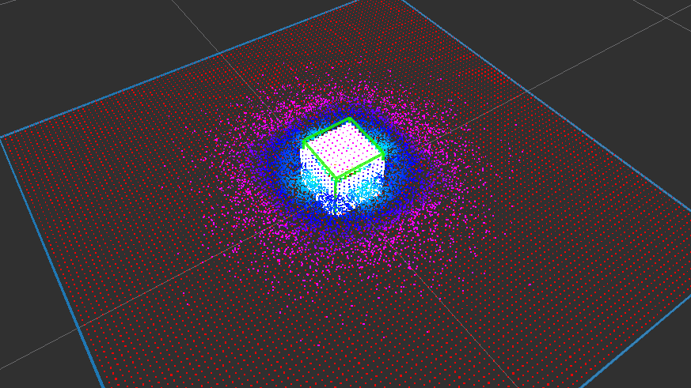

# PlaneSupportedCuboidEstimator


Estimate a cuboid on a plane. Plane information is used as hint.
It uses particle filter to estimate pose of cuboid.

[jsk_pcl/InteractiveCuboidLikelihood](interactive_cuboid_likelihood.md) is a helper nodelet
to confirm likelihood function behaves as expected.

## Subscribing Topics
* `~input` (`sensor_msgs/PointCloud2`)

  Input pointcloud
* `~fast_input` (`sensor_msgs/PointCloud2`)

  Faster input pointcloud
* `~input/polygon` (`jsk_recognition_msgs/PolygonArray`)
* `~input/coefficients` (`jsk_recognition_msgs/ModelCoefficientsArray`)

  Planes which may support cuboid object

## Publishing Topics
* `~output/result` (`jsk_recognition_msgs/BoundingBoxArray`)

  Result of estimation as bounding box.

* `~output/result_pose` (`geometry_msgs/PoseStamped`)

  Estimated cuboid pose.

* `~output/candidate_cloud` (`sensor_msgs/PointCloud2`)

  Candidate pointcloud extracted from polygons.

* `~output/particles` (`sensor_msgs/PointCloud2`)

  Particles as pointcloud (xyzi)
* `~output/histogram/global/x` (`jsk_recognition_msgs/HistogramWithRange`)
* `~output/histogram/global/y` (`jsk_recognition_msgs/HistogramWithRange`)
* `~output/histogram/global/z` (`jsk_recognition_msgs/HistogramWithRange`)
* `~output/histogram/global/roll` (`jsk_recognition_msgs/HistogramWithRange`)
* `~output/histogram/global/pitch` (`jsk_recognition_msgs/HistogramWithRange`)
* `~output/histogram/global/yaw` (`jsk_recognition_msgs/HistogramWithRange`)
* `~output/histogram/dx` (`jsk_recognition_msgs/HistogramWithRange`)
* `~output/histogram/dy` (`jsk_recognition_msgs/HistogramWithRange`)
* `~output/histogram/dz` (`jsk_recognition_msgs/HistogramWithRange`)

  Histograms of particles for each dimension

## Advertising Services
* `~reset` (`std_srvs/Empty`)

  Reset particles filters.

## Parameters
* `~sensor_frame` (String, default: `odom`)

  Frame ID of sensor frame. It is used to compute viewpoint and occlusion.

Parameters below can be changed by `dynamic_reconfigure`.

* `~init_local_position_z_min` (Float, default: `0.0`)
* `~init_local_position_z_max` (Float, default: `1.0`)

  Height limits of initial random polygonal prism at local coordinates in meters.

* `~init_local_orientation_roll_mean` (Float, default: `0.0`)
* `~init_local_orientation_roll_variance` (Float, default: `0.005`)
* `~init_local_orientation_pitch_mean` (Float, default: `0.0`)
* `~init_local_orientation_pitch_variance` (Float, default: `0.005`)
* `~init_local_orientation_yaw_mean` (Float, default: `0.0`)
* `~init_local_orientation_yaw_variance` (Float, default: `0.01`)
* `~init_dx_mean` (Float, default: `0.1`)
* `~init_dx_variance` (Float, default: `0.001`)
* `~init_dy_mean` (Float, default: `0.1`)
* `~init_dy_variance` (Float, default: `0.001`)
* `~init_dz_mean` (Float, default: `0.1`)
* `~init_dz_variance` (Float, default: `0.001`)

  Parameters of random gaussian of initial particle cuboid along each axis at local coordinates.

* `~use_init_world_position_z_model` (Bool, default: `False`)

  Whether to enable `~init_world_position_z_min` and `~init_world_position_z_max`
  to filter initial particle cuboid.

* `~init_world_position_z_min` (Float, default: `0.0`)
* `~init_world_position_z_max` (Float, default: `1.0`)

  Height limits of initial particle cuboid at world coordinates in meters.

* `~disable_init_roll` (Bool, default: `False`)
* `~disable_init_pitch` (Bool, default: `False`)

  Force to set roll/pitch of initial particle cuboid at world coordinates to 0 if True.

* `~use_global_init_yaw` (Bool, default: `False`)

  Enable `~init_global_orientation_yaw_mean` and `~init_global_orientation_yaw_variance`
  to decide intial particle states.

* `~init_global_orientation_yaw_mean` (Float, default: `0.0`)
* `~init_global_orientation_yaw_variance` (Float, default: `0.01`)

  Parameters of random gaussian of initial particle cuboid along yaw at world coordinates.

* `~particle_num` (Int, default: `1000`)

  Number of points in particle.

* `~step_x_variance` (Float, default: `0.0001`)
* `~step_y_variance` (Float, default: `0.0001`)
* `~step_z_variance` (Float, default: `0.0001`)
* `~step_roll_variance` (Float, default: `0.0001`)
* `~step_pitch_variance` (Float, default: `0.0001`)
* `~step_yaw_variance` (Float, default: `0.0001`)
* `~step_dx_variance` (Float, default: `0.0001`)
* `~step_dy_variance` (Float, default: `0.0001`)
* `~step_dz_variance` (Float, default: `0.0001`)

  Parameters of random gaussian for sampling and tracking particle cuboid.

* `~min_dx` (Float, default: `0.001`)
* `~min_dy` (Float, default: `0.001`)
* `~min_dz` (Float, default: `0.001`)

  Minimum limits of random value generated from `~step_d?_variance`.

* `~use_init_polygon_likelihood` (Bool, default: `False`)

  Whether to use likelihood of input polygon.

* `~fast_cloud_threshold` (Float, default: `2.0`)

  If distance to object is smaller than
  `~fast_cloud_threshold`, `~fast_input` will be used.


## Sample

```bash
roslaunch jsk_pcl_ros sample_plane_supported_cuboid_estimator.launch
```
