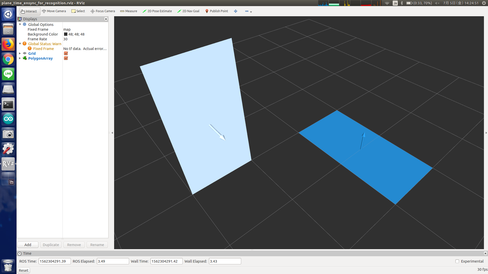

# plane_time_ensync_for_recognition.py



## What Is This

This node force `jsk_recognition_msgs/PolygonArray` and
`jsk_recognition_msgs/ModelCoefficientsArray` topics to synchoronize.


## Subscribing Topic

* `planes` (`jsk_recognition_msgs/PolygonArray`)
* `planes_coefficients` (`jsk_recognition_msgs/ModelCoefficientsArray`)

  Plane polygons and their normal coefficients.

* `timer` (`sensor_msgs/PointCloud2`)

  Trigger topic for publishing synchoronized polygons and coefficients.


## Publishing Topic

* `ensynced_planes` (`jsk_recognition_msgs/PolygonArray`)
* `ensynced_planes_coeffients` (`jsk_recognition_msgs/ModelCoefficientsArray`)

  Synchoronized polygons and coefficients.


## Parameters

None.


## Sample

```bash
roslaunch jsk_pcl_ros sample_plane_time_ensync_for_recognition.launch
```
