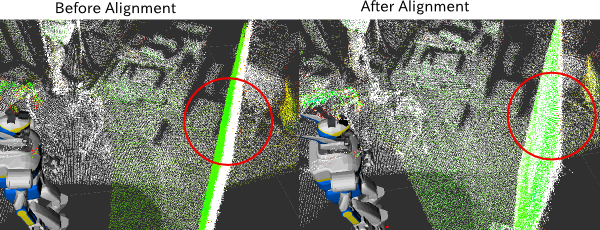

# PointCloudLocalization


Localize 6d pose of robot using ICP registration of pointcloud.
It publishes tf transformation from global frame to odometry frame like amcl does.

## Subscribing Topic
* `~input` (`sensor_msgs/PointCloud2`)

  Input pointcloud to align.

## Publishing Topic
* `~output` (`sensor_msgs/PointCloud2`)

  Concatenated pointcloud.

## Parameters
* `~global_frame` (String, default: `map`)

  Frame ID of output pointcloud.

* `~odom_frame` (String, default: `odom`)

  Frame ID of broadcasted transform of localization.

* `~initialize_from_tf` (Bool, default: `false`)

  Whether to initialize transform from `~initialize_tf` frame.

* `~initialize_tf` (String, default: `odom_on_ground`)

  Frame ID used for initialization of transform.

  This parameter is enabled only when `~initialize_from_tf` is true.

* `~clip_unseen_pointcloud` (Bool, default: `false`)

  Whether to filter out pointcloud which cannot be seen by a sensor.

* `~sensor_frame` (String, default: `BODY`)

  Frame ID used for filtering pointcloud before running ICP.

  This parameter is enabled only when `~clip_unseen_pointcloud` is true.

* `~tf_rate` (Double, default: `20.0`)

  Frequency to publish tf transformations [Hz].

* `~cloud_rate` (Double, default: `10.0`)

  Frequency to publish `~output` topic [Hz].

* `~leaf_size` (Double, default: `0.01`)

  Resolution of voxel grid downsampling in meters.

* `~use_normal` (Bool, default: `false`)

  Support normal field in `~input` pointcloud.

## Internally Using Services
* `~icp_align` (`jsk_pcl_ros/ICPAlign`)

  ICP service to align pointcloud

## Advertising Services
* `~localize` (`std_srvs/Empty`)

  Run localization

* `~update_offset` (`jsk_recognition_msgs/UpdateOffset`)

  Update transformation between odom frame and global frame manuaaly.
  Currently no tf is resolved.

## Sample

```bash
roslaunch jsk_pcl_ros sample_pointcloud_localization.launch
```
