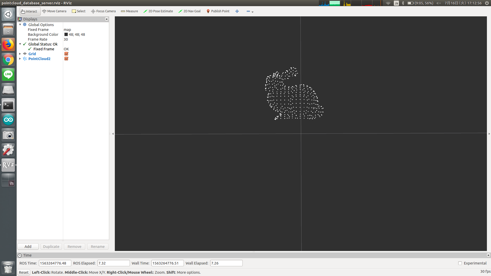

# PointcloudDatabaseServer



load PCD or STL model files and publish pointcloud array.

## Publishing Topic
* `~output` (`jsk_recognition_msgs/PointsArray`)

  Output pointcloud array.

* `~cloud` (`sensor_msgs/PointCloud2`)

  Output pointcloud.

## Parameters
* `~models` (Array of string, required)

  This parameter is an array of PCD/STL model file path.

* `~duration` (Float, default: `1.0`)

  Time between each publish in seconds.

* `~use_array` (Bool, default: `True`)

  If true, pointcloud array will be published to `~output`.

  If false, first index of pointcloud array will be published to `~cloud`.

## Sample

```bash
roslaunch jsk_pcl_ros sample_pointcloud_database_server.launch
```
