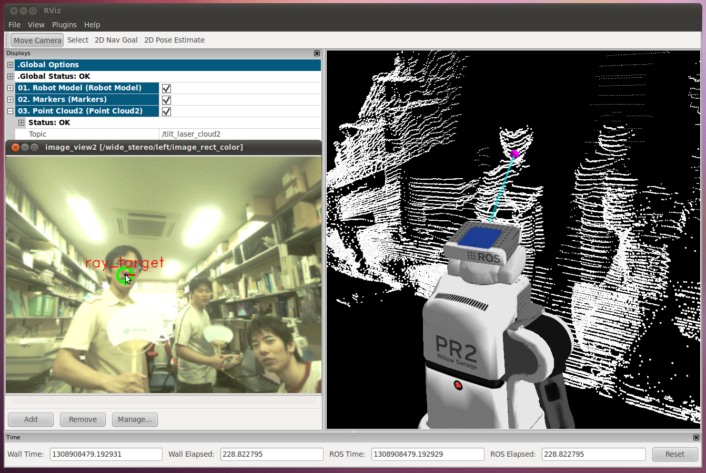
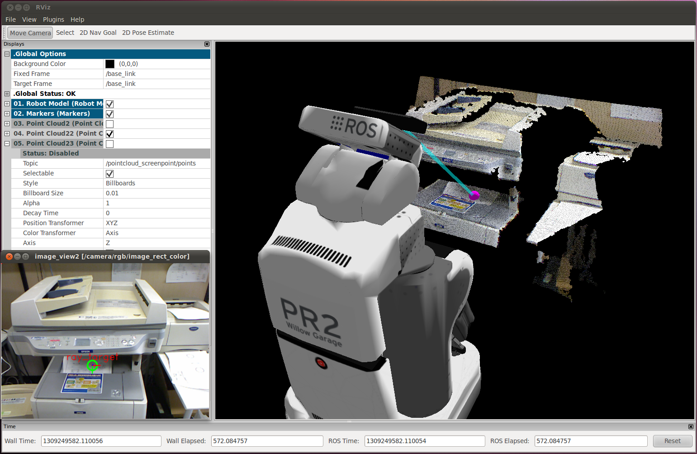

# PointcloudScreenpoint
## What is this


Use pointcloud from kinect



Use pointcloud from laser


Use amplifiered pointclouds published by laser


This is a nodelet to convert (u, v) coordinate on a image to 3-D point.
It retrieves 3-D environment as pointcloud.

[pointcloud_screenpoint_sample.launch](launch/pointcloud_screenpoint_sample.launch) is a sample launch file.

## Subscribing Topics
* `~points` (`sensor_msgs/PointCloud2`):

   Pointcloud source to estimate 3D points that the user wantedt to specify on a 2D screen
* `~point` (`geometry_msgs/PointStamped`):

   Input point to represent (u, v) image coordinate and this topic is enabled only if `~use_point` parameter is set `True`.
   Only x and y fileds are used and the header frame_id is ignored.
   If `~use_sync` parameter is set `True`, `~points` and `~point` are synchronized.

* `~polygon` (`geometry_msgs/PolygonStamped`):

   Input rectangular region on image local coordinates and this topic is enabled only if `~use_rect` parameter is set `True`.
   Only x and y fields are used and the header frame_id is ignored.
   And the region should be rectangular.
   If `~use_sync` parameter is set `True`,

* `~poly` (`geometry_msgs/PolygonStamped`):`

  Input polygonal region in image local coordinates.
* `~point_array` (`sensor_msgs/PointCloud2`):

   Input points to represent series of (u, v) image coordinate and this
   topic is enabled only if `~use_point_array` parameter is set `True`.
   Only x and y fields are used and the header frame_id is ignored.
   If `~use_sync` parameter is set `True`, `~point_array` and `~point` are
   synchronized.

## Publishing Topics
* `~output_point` (`geometry_msgs/PointStamped`):

   The topic to be used to publish one point as a result of screenpoint.
* `~output` (`sensor_msgs/PointCloud`):

   The topic to be used to publish series of points as a result of screenpoint.
* `~output_poly` (`geometry_msgs/PolygonStamped`)

   Projected points of `~poly`.
## Advertising Servicies
* `~screen_to_point` (`jsk_pcl_ros::TransformScreenpoint`)

   ROS Service interface to convert (u, v) image coordinate into 3-D point.

   The definition of `jsk_pcl_ros::TransformScreenpoint` is:

```
# screen point
float32 x
float32 y
---
# position in actual world
std_msgs/Header header
geometry_msgs/Point point
geometry_msgs/Vector3 vector
```

   With int this service, the latest pointcloud acquired by `~points` is used to convert (u, v) into 3-D point.

## Parameters
* `~use_sync` (Boolean, default: `False`):

   If this parameter is set to `True`, the timestamps of 3-D pointcloud and the target point/rectangle/point array are synchronized.
* `~queue_size` (Integer, default: `1`):

   Queue length of subscribing topics.
* `~crop_size` (Integer, default: `10`):

   The size of approximate region if `~points` pointcloud has nan holes.
* `~use_rect` (Boolean, default: `False`):

   Enable `~polygon` topic.
* `~use_poly` (Boolean, default: `False`):

   Enable `~poly` topic.
* `~use_point` (Boolean, default: `False`):

   Enable `~point` topic.
* `~use_point_array` (Boolean, default: `False`):

   Enable `~point_array` topic.
* `~publish_points` (Boolean, default: `False`):

   Publish result of screenpoint to `~output` topic.
* `~publish_point` (Boolean, default: `False`):

   Publish result of screenpoint to `~output_point` topic.
