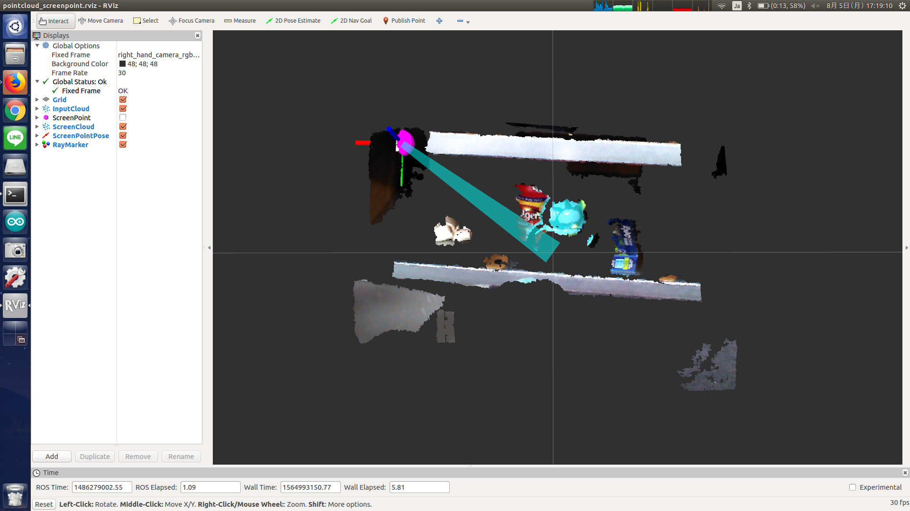

# pointcloud_screenpoint.l



## What Is This

This node is a service client of [PointcloudScreenPoint](pointcloud_screenpoint.md).


## Subscribing Topic

* `$(param ~sensor_topic)/screenpoint` (`geometry_msgs/PointStamped`)

  Screen point from `image_view2`.


## Publishing Topic

* `ray_marker_array` (`visualization_msgs/MarkerArray`)

  Marker of touched point which can be visualized in `rviz`.

* `image_marker` (`image_view2/ImageMarker2`)

  Marker of touched point which can be visualized in `image_view2`.

* `ray_coords` (`geometry_msgs/PoseStamped`)

  Pose of 3D touched point.


## Internally Calling Service

* `$(param ~ray_srv)` (`jsk_recognition_msgs/TransformScreenpoint`)

  Service server.


## Parameter

* `~sensor_topic` (String, __required__)

  Name space of subscribed topic.

  See `Subscribing Topic`.

* `~ray_srv` (String, __required__)

  Name of service server.

  See `Internally Calling Service`.

* `~base_frame` (String, default: `base_footprint`)

  Frame ID of `ray_coords`.


## Sample

```bash
roslaunch jsk_pcl_ros sample_pointcloud_screenpoint.launch
```
