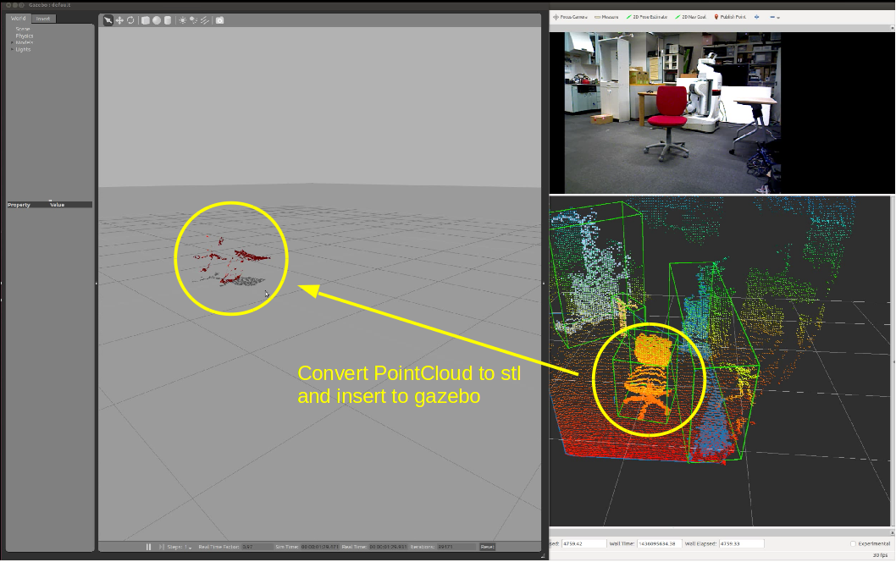

# PointcloudToStl

## What Is This
This nodelet convert pointcloud to stl mesh and generate a stl file.

## Using Services
* `~create_stl` (`jsk_pcl_ros/SetPointCloud2`):

   Create a stl file from pointcloud data.
   Returns filename.

## Sample
Click bounding box in rviz.
Then, selected point clouds are published and passed to pointcloud_to_stl node.
Stl file is generated and spawned into gazebo as urdf model.

```
roslaunch jsk_pcl_ros pointcloud_to_stl.launch
```
