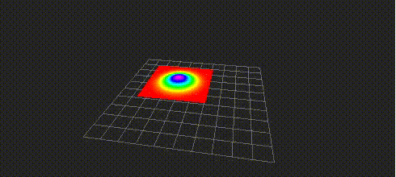

# PoseWithCovarianceStampedToGaussianPointCloud

Visualize `geometry_msgs/PoseWithCovarianceStamped` as gaussian pointcloud.
Pointcloud is computed within a region of 3 sigma.

## Subscribing Topics
* `~input` (`geometry_msgs/PoseWithCovarianceStamped`)

  Input pose

## Publishing Topics
* `~output` (`sensor_msgs/PointCloud2`)

  Output pointcloud

## Parameters
* `~cut_plane` (default: `xy`)

  You can choose a plane to compute gaussian distribution from `xy`, `yz` or `zx`.
* `~sampling_num` (default: `10`)

  The number of sampling for each axis. The number of points will square of `~sampling_num`.
* `~normalize_method` (default: `normalize_area`)
* `~normalize_value` (default: `1.0`)

  You can choose `normalize_area` or `normalize_height` to normalize gaussian distribution.
  If you choo `normalize_area`, area of gaussian distribution will be `~normalize_value`.
  If you choo `normalize_height`, the maximum height of gaussian distribution will be `~normalize_value`.
