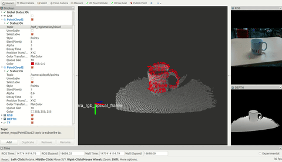
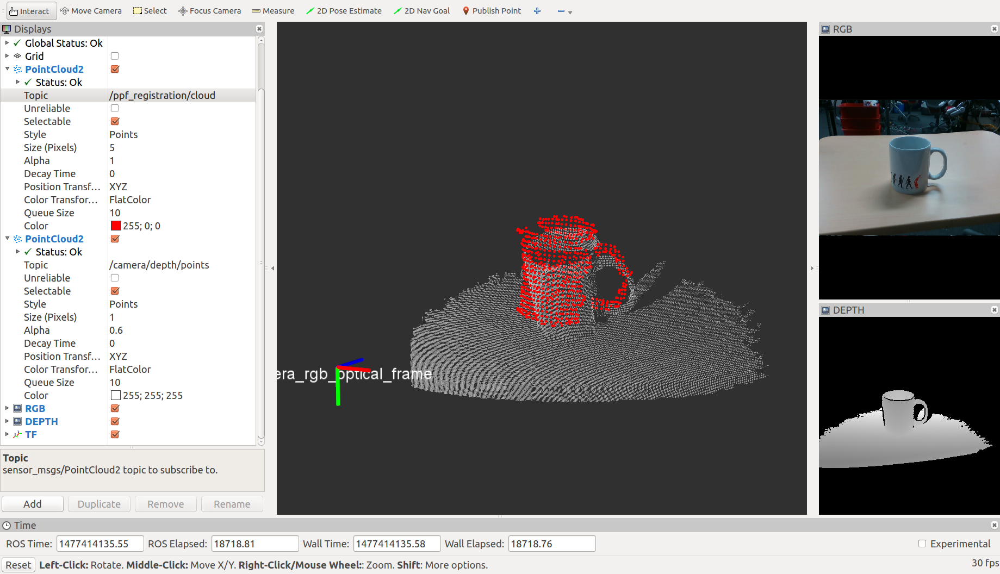

PPFRegistration
===============

What is this?
-------------

Compute normals for an organized point cloud using integral images.

Subscribing Topics
------------------

- ``~input/cloud`` (``sensor_msgs/PointCloud2``)

  Input point cloud. (``PointXYZ``)

- ``~input/reference_cloud`` (``sensor_msgs/PointCloud2``)

  Reference point cloud. (``PointXYZ``)

  Subscribe when parameter ``use_array`` is ``false``.

- ``~input/reference_array`` (``jsk_recognition_msg/PointsArray``)

  Reference point cloud array. (``PointXYZ``)

  Subscribe when parameter ``use_array`` is ``true``.

Publishing Topics
-----------------

- ``~output/cloud`` (``sensor_msgs/PointCloud2``)

  Output aligned reference point cloud.

  Publish when parameter ``use_array`` is ``false``.

- ``~output/pose_stamped`` (``geometry_msg/PoseStamped``)

  Output aligned reference pose.

  Publish when parameter ``use_array`` is ``false``.

- ``~output/points_array`` (``jsk_recognition_msg/PointsArray``)

  Output aligned reference point cloud array.

  Publish when parameter ``use_array`` is ``true``.

- ``~output/pose_array`` (``geometry_msg/PoseArray``)

  Output aligned reference pose array.

  Publish when parameter ``use_array`` is ``true``.

Parameters
----------

- ``~use_array`` (Boolean, default: ``false``)

  Determine whether reference format is ``jsk_recognition_msg/PointsArray`` or ``sensor_msgs/PointCloud2``

- ``~queue_size`` (Int, defalut: 100)

  Queue size

- ``~approximate_sync`` (Boolean, default ``false``)

  Select to use approximate sync policy

- ``search_radius`` (Double, default 0.05)

  Search radius for normal calculation

- ``sampling rate`` (Int, default 10)

  Sampling rate for registration

- ``position_clustering_threshold`` (Double, default 0.2)

  Position clustering threshold for registration

- ``rotation_clustering_threshold`` (Double, defalut 30)

  Rotation clustering threshold for registration

Sample
------

.. code-block:: bash

  roslaunch jsk_pcl_ros sample_ppf_registration.launch
